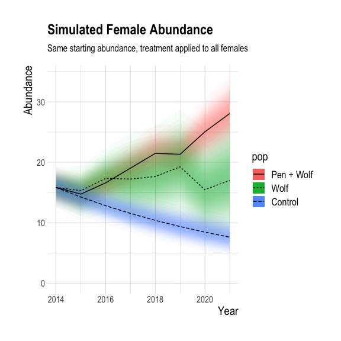
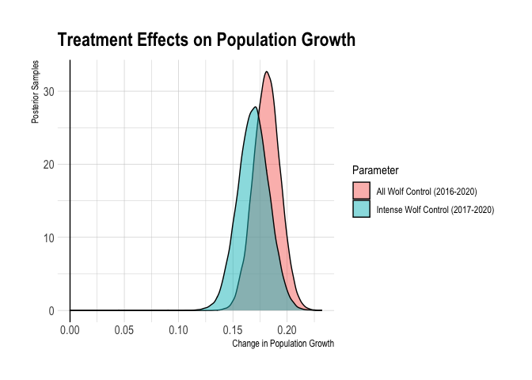
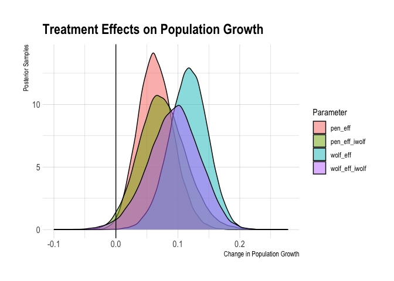

Klinse-Za Caribou IPM
================
Sara Williams, Hans Martin, and Clayton Lamb
01 June, 2021

\#\#Load Data

``` r
library(ggmcmc)
library(jagsUI)
library(knitr)
library(gt)
library(ggallin)
library(hrbrthemes)
library(RColorBrewer)
library(MCMCvis)
library(readxl)
library(piggyback)
library(here)
library(usethis)
library(tidyverse)

##define fn
gm_mean = function(a){prod(a)^(1/length(a))}


# Read in raw data
adult_female_survival <- read.csv(here::here("data", "KZ", "adult_female_survival_KZ.csv"))
adult_female_recruit <- read.csv(here::here("data", "KZ", "adult_female_recruit_KZ.csv"))


# remove survey counts <80% sightability
count_dat <- read_xlsx(here::here("data", "KZ", "Count_summary_KZ.xlsx"))%>%
  mutate_at(c("SurveryCount_ADULTMF","SurveryCount_CALFMF", "Estimate_ADULTMF","Estimate_CALFMF"), funs(round(., 0)))
  # mutate(SurveryCount_ADULTMF=case_when(Mean_Sightability<0.8~NA_real_, TRUE~SurveryCount_ADULTMF),
  #        SurveryCount_CALFMF=case_when(Mean_Sightability<0.8~NA_real_, TRUE~SurveryCount_CALFMF))


adult_female_pencount_in <-  read.csv(here::here("data", "KZ", "adult_female_pencount_in_KZ.csv"))
subadult1_female_pencount_in <-  read.csv(here::here("data", "KZ", "sa1_pencount_in_KZ.csv"))
calf_female_pencount_recruit <-  read.csv(here::here("data", "KZ", "calf_female_pencount_recruit_KZ.csv"))

sightability <- read.csv(here::here("data", "KZ", "sightability_KZ.csv"))
```

\#\#Prep sightability bootstrap

\#\#Prep for IPM

``` r
#  Years of study
yrs <-  seq(from = 1995, to = 2021, by = 1)
nyr <- length(yrs)
yr_idx <- seq(from = 1, to = nyr, by = 1)
yr_df <- as.data.frame(cbind(yrs, yr_idx))

#  Years to simulate data
sim_yr_df <- yr_df %>%
    dplyr::filter(yrs >= 2014)
sim_yrs <- sim_yr_df$yr_idx
nsimyr <- length(sim_yrs)

sim_yrs2 <- yr_df %>%
    dplyr::filter(yrs >= 2013)%>%
  pull(yr_idx)

#  Wolf and pen indicator per year
wolfpen_ind <- adult_female_pencount_in$Wolf_control_pen

#  Create vectors of sex ratio
adult_sex_ratio <- count_dat$SexRatio

#  Create vectors of known numbers of adult females and calves going into and coming out  of pen
nPen <- adult_female_pencount_in$Mean
nPenSA <- subadult1_female_pencount_in$Mean
nPenC <- calf_female_pencount_recruit$Mean

#  Recruitment 
adult_female_recruit <- adult_female_recruit %>%    
    mutate(Mean=Mean/2, SD=SD/2)

meanr <- array(NA, c(1,1,2)) 
meanr[1,1,1] <- mean(adult_female_recruit$Mean, na.rm = TRUE)
meanr[1,1,2] <- 10


# Survival - need estimates for both penned and control (not penned) population units
means <- array(NA, c(1,2,2))

adult_female_survival_control <- adult_female_survival %>%
    dplyr::filter(Pop == 1) 
means[1,1,1] <- mean(adult_female_survival_control$Mean, na.rm = TRUE)
means[1,1,2] <- 10

adult_female_survival_pen <- adult_female_survival %>%
    dplyr::filter(Pop == 2) 
means[1,2,1] <- mean(adult_female_survival_pen$Mean, na.rm = TRUE)
means[1,2,2] <- 10


# Starting population size of population unit (vector of values for each age class)
n1 <- numeric()
n1[1] <- count_dat$Estimate_CALFMF[1]*.5
n1[2] <- count_dat$Estimate_ADULTMF[1]*.1*count_dat$SexRatio[1]
n1[3] <- count_dat$Estimate_ADULTMF[1]*.9*count_dat$SexRatio[1]


#  Survival estimates by year of penned and control (not penned) population units separately
sdat <- adult_female_survival %>%
    mutate(dau = 1, 
        age = 3,
        pop = Pop,
        mu = ifelse(Mean!= 1, Mean, 0.99),
        SD = ifelse(SD!= 0, SD, median(SD, na.rm=TRUE)))%>%
  mutate(tau = 1/ ((SD/1) * (SD/1))) %>%
    #mutate(tau = 1/ (SD * SD)) %>%
    dplyr::filter(!is.na(mu)) %>%
    left_join(yr_df, by = c("Year" = "yrs")) %>%
    dplyr::select(dau, yr = yr_idx, age, pop, mu, tau)
sdat$tau[sdat$tau == "Inf"] <- mean(sdat$tau[!is.infinite(sdat$tau)])
ns <- nrow(sdat)    


#  Recruitment estimates by year of control (not penned) population unit
rdat <- adult_female_recruit  %>%
    mutate(dau = 1, 
        age = NA,
        pop = Pop,
        mu = Mean,
        SD = ifelse(SD!= 0, SD, median(SD, na.rm=TRUE)))%>%
  mutate(tau = 1/ ((SD/1) * (SD/1))) %>%
    #mutate(tau = 1/ (SD * SD)) %>%
    dplyr::filter(!is.na(mu)) %>%
    left_join(yr_df, by = c("Year" = "yrs")) %>%
    dplyr::select(dau, yr = yr_idx, age, pop, mu, tau) 
nr <- nrow(rdat)    


#  Minium counts of all individuals  combined over penned and control (not penned) 
#   population units 
mindat <- count_dat %>%
    mutate(dau = 1, 
        age = NA,
        pop = NA,
        mu = SurveryCount_ADULTMF,
        tau = NA) %>%
    dplyr::filter(mu > 4) %>%
    left_join(yr_df, by = c("Year" = "yrs")) %>%
    dplyr::select(dau, yr = yr_idx, age, pop, mu, tau)
nmin <- nrow(mindat)

calf_mindat <- count_dat %>%
    mutate(dau = 1, 
        age = NA,
        pop = NA,
        mu = SurveryCount_CALFMF,
        tau = NA) %>%
    dplyr::filter(mu > 4) %>%
    left_join(yr_df, by = c("Year" = "yrs")) %>%
    dplyr::select(dau, yr = yr_idx, age, pop, mu, tau) 
nminc <- nrow(calf_mindat)

abundat <- count_dat %>%
    mutate(dau = 1, 
        age = NA,
        pop = NA,
        mu = Estimate_ADULTMF,
        tau = 1/(SD_Estimate_ADULTMF * SD_Estimate_ADULTMF)) %>%
    dplyr::filter(mu > 4) %>%
    left_join(yr_df, by = c("Year" = "yrs")) %>%
    dplyr::select(dau, yr = yr_idx, age, pop, mu, tau) 
na <- nrow(abundat)

calf_abundat <- count_dat %>%
    mutate(dau = 1, 
        age = NA,
        pop = NA,
        mu = Estimate_CALFMF,
        tau = 1/(SD_Estimate_CALFMF * SD_Estimate_CALFMF)) %>%
    dplyr::filter(mu > 4) %>%
    left_join(yr_df, by = c("Year" = "yrs")) %>%
    dplyr::select(dau, yr = yr_idx, age, pop, mu, tau) 
nac <- nrow(calf_abundat)
```

## Run model in JAGS

``` r
# MCMC params
nt <- 3
nb <- 8000
nc <- 3
nad <- 5000
ni <- 50000


#  Gather data inputs in a list
ipm_dat <- list(nyr = nyr,
    nmin = nmin,
    ns = ns,
    nr = nr,
    na = na,
    nac = nac,
    nminc = nminc,
    #wolfpen_ind = wolfpen_ind,
    means = means,
    meanr = meanr,
    n1 = n1, 
    adult_sex_ratio = adult_sex_ratio,
    mindat = mindat, 
    calf_mindat = calf_mindat, 
    abundat = abundat,
    calf_abundat = calf_abundat,
    nPenC = nPenC,
    nPen = nPen,
    nPenSA = nPenSA,
    sdat = sdat, 
    rdat = rdat,
    sim_yrs = sim_yrs,
  sim_yrs2 = sim_yrs2,
    nsimyr = nsimyr)


#  Initial values for N to avoid parent node erros
Nst <- array(10, c(nyr,3,2))
Nst[,,2] <- NA
ipm_inits <- function(){ 
        list(N = Nst)}
    
#  Model parameters to monitor
model_parms <- c("lambda","lambdaC", 
    "totN", "totC", "totP", 
    "N", "S", "R", 
    "wolfpen_eff_r", "wolfpen_eff_s",
    "totCalves", "totCalvesC", "totCalvesP",
    "totAdults", "totAdultsC", "totAdultsP",
    "totAdultsMF", "totCalvesMF", "totNMF",
    "geom_mean_lambda",
    "geom_mean_lambda_prepen", "geom_mean_lambda_postpen","geom_mean_lambda_postwolf",
    "diff_geom_mean_lambda_post_to_pre", "diff_geom_mean_lambda_post_to_pre_iwolf",
    "geom_mean_lambda_SimPen","geom_mean_lambda_SimC", "geom_mean_lambda_SimC2",
    "geom_mean_lambda_postpen_iWolf", "geom_mean_lambda_SimPen_iWolf", "geom_mean_lambda_SimC_iWolf",
    "simN", "simTotC", "simTotP", "simTotBAU", "simTotCMF", "simTotPMF", "simTotBAUMF",
    "mean_surv_pre","mean_surv_pen","mean_surv_wolf",
    "mean_r_pre","mean_r_pen","mean_r_wolf",
    "mean_r3_pre","mean_r3_pen","mean_r3_wolf",
    "wolf_eff_proportion","pen_eff_proportion",
    "lambdaSimC", "lambdaSimC2","lambdaSimP",
    "wolf_eff","pen_eff", "wolf_eff_iwolf","pen_eff_iwolf","pen_eff_ipen", "wolf_eff_ipen",
    "diff_geom_mean_lambda_post_to_pre_ipen", "geom_mean_lambda_postpen_iPen", "geom_mean_lambda_SimPen_iPen",
    "mean_surv_post_pooled","mean_r_post_pooled","mean_r3_post_pooled","penprop")


#  Run model with survival and recruitment varying per year
out_rnd_eff <- jagsUI::jags(ipm_dat, 
    inits = ipm_inits,
    model_parms,
    model.file = here::here("jags","KZ_IPM_RE_w_abund_and_mincount_CL.txt"),
    n.chains = nc, 
    n.iter = ni,
    n.burnin = nb,
    n.thin = nt,
    n.adapt = nad)

save(out_rnd_eff, file = here::here("output", "kz_out_rnd_eff.Rdata"))
```

\#\#MODEL DIAGNOSTICS

\#\#ABUNDANCE

``` r
res_df <- data.frame(rbind(yr_df,yr_df),
                     est=c(out_rnd_eff$mean$totN, out_rnd_eff$mean$lambda),
                     q2.5=c(out_rnd_eff$q2.5$totN, out_rnd_eff$q2.5$lambda),
                     q97.5=c(out_rnd_eff$q97.5$totN, out_rnd_eff$q97.5$lambda),
                     param=rep(c("totN", "Lambda"), each=nyr))

res_df <- res_df[-(nyr+1),]

ggplot(res_df,aes(x = yrs, y = est, ymin=q2.5, ymax=q97.5, fill=param)) +
  geom_cloud(steps=20, max_alpha = 1,se_mult=1.96)+
  geom_line() +
  geom_point() +
  theme_ipsum()+
  theme(legend.position = "none")+
  ylab("Estimate")+
  xlab("Year")+
  facet_wrap(vars(param), scales="free_y")+
  geom_vline(xintercept = 2012.5)+
  geom_vline(xintercept = 2013.5,linetype="dashed")+
  labs(x="Year",title="Population Growth Trajectory")
```

<!-- -->

``` r
res_df <- res_df%>%rbind(data.frame(rbind(yr_df),
                          est=c(out_rnd_eff$mean$totNMF),
                          q2.5=c(out_rnd_eff$q2.5$totNMF),
                          q97.5=c(out_rnd_eff$q97.5$totNMF),
                          param=rep(c("totNMF"), each=nyr)))


  res_df%>%filter(param!="Lambda")%>%
  ggplot(aes(x = yrs, y = est, ymin=q2.5, ymax=q97.5, fill=param)) +
  geom_cloud(steps=20, max_alpha = 1,se_mult=1.96)+
  geom_line() +
  geom_point() +
  theme_ipsum()+
  theme(legend.position = "none")+
  ylab("Estimate")+
  xlab("Year")+
  facet_wrap(vars(param), scales="free_y")+
  geom_vline(xintercept = 2012.5)+
  geom_vline(xintercept = 2013.5,linetype="dashed")+
    labs(x="Year",title="Population Abundance and Trajectory")+
  expand_limits(y=c(0))
```

<!-- -->

``` r
#   
# err <- ggs(out_rnd_eff$samples, burnin=8000)%>%
#   filter(str_detect(Parameter, 'totN|totNMF'),
#          Iteration%in%(runif(500,2,13999)%>%round(0)),
#          Chain==1)%>%
#   mutate(param=str_split(Parameter,"\\[", simplify = TRUE)[,1],
#          yr_idx=str_split(Parameter,"\\[", simplify = TRUE)[,2]%>%str_remove("\\]"))%>%
#   left_join(yr_df%>%mutate(yr_idx=as.character(yr_idx)), "yr_idx")%>%
#     arrange(Iteration,param, yrs)
# 
# 
# 
#   ggplot() +
#   geom_path(data=err, aes(x = yrs, y = value, fill=param, color=param, group=Iteration), alpha=0.05)+
#   geom_line(data=res_df%>%filter(param!="Lambda"), aes(x = yrs, y = est, ymin=q2.5, ymax=q97.5, fill=param)) +
#   geom_point(data=res_df%>%filter(param!="Lambda"), aes(x = yrs, y = est, ymin=q2.5, ymax=q97.5, fill=param)) +
#   theme_ipsum()+
#   theme(legend.position = "none")+
#   ylab("Estimate")+
#   xlab("Year")+
#   facet_wrap(vars(param), scales="free_y")+
#   geom_vline(xintercept = 2012.5)+
#   geom_vline(xintercept = 2013.5,linetype="dashed")+
#     labs(x="Year",title="Population Abundance and Trajectory")+
#   expand_limits(y=c(0))

#ggsave(here::here("plots", "abundance_MF.png"), width=5, height=8)
```

\#\#GROUP SPECIFIC VITAL RATES

``` r
#R

pop_df_r <- rbind(
                  data.frame(estimate=c(
                                  out_rnd_eff$mean$R[,2]),
                       lower=c(
                                  out_rnd_eff$mean$R[,2]),
                       upper=c(
                                  out_rnd_eff$mean$R[,2]),
                       pop=rep(c("Pen"), each=nyr),
                       param="Recruitment",
                       yrs=rep(yrs, times=1)),
                    data.frame(estimate=c(
                                  out_rnd_eff$mean$R[,1]),
                       lower=c(
                                  out_rnd_eff$q2.5$R[,1]),
                       upper=c(
                                  out_rnd_eff$q97.5$R[,1]),
                       pop=rep(c("Free"), each=nyr),
                       param="Recruitment",
                       yrs=rep(yrs, times=1)))%>%
  mutate(lower=case_when(lower<0~0,
                         TRUE~lower))

#S
pop_df_s <- data.frame(estimate=c(out_rnd_eff$mean$S[,1],
                                  out_rnd_eff$mean$S[,2]),
                       lower=c(out_rnd_eff$q2.5$S[,1],
                               out_rnd_eff$q2.5$S[,2]),
                       upper=c(out_rnd_eff$q97.5$S[,1],
                               out_rnd_eff$q97.5$S[,2]),
                       pop=rep(c("Free", "Pen"), each=nyr),
                       param="Survival",
                       yrs=rep(yrs, times=2))


# pop_df <- data.frame(estimate=pop_df_s$estimate/(1-pop_df_r$estimate),
#                      lower=pop_df_s$lower/(1-pop_df_r$lower),
#                      upper=pop_df_s$upper/(1-pop_df_r$upper),
#                      pop=rep(c("Free", "Pen"), each=nyr),
#                      yrs=rep(yrs, times=2))

pop_df <- data.frame(estimate=pop_df_s$estimate+pop_df_r$estimate,
                     lower=pop_df_s$lower+pop_df_r$lower,
                     upper=pop_df_s$upper+pop_df_r$upper,
                     pop=rep(c("Free", "Pen"), each=nyr),
                     yrs=rep(yrs, times=2))

pop_df2 <- rbind(pop_df_r, pop_df_s)

ggplot(pop_df2%>%
         filter(yrs>1996)%>%
         mutate(estimate=case_when(param=="Recruitment" & yrs<2015 & pop=="Pen"~NA_real_, 
                                   param=="Survival" & yrs<2014 & pop=="Pen"~NA_real_, 
                                   TRUE~estimate)),
       aes(x = yrs, y = estimate, fill=pop)) +
  geom_line(aes(color=pop)) +
    geom_cloud(aes( ymin=lower, ymax=upper),steps=20, max_alpha = 1,se_mult=1.96)+
  theme_ipsum()+
  theme_ipsum()+
  labs(x="Year", y="Rate", title="Annual vital rates for penned and free animals")+
  facet_wrap(vars(param), scales="free_y")+
    geom_vline(xintercept = 2013)+
  geom_vline(xintercept = 2014,linetype="dashed")
```

<!-- -->

``` r
#ggsave(here::here("plots", "vital_rates.png"), width=8, height=5)
```

\#\#COMPARE TO RAW VITAL RATE DATA

``` r
calc.vr <- pop_df2%>%
         filter(yrs>1996)%>%
         mutate(estimate=case_when(param=="Recruitment" & yrs<2015 & pop=="Pen"~NA_real_, 
                                   param=="Survival" & yrs<2014 & pop=="Pen"~NA_real_, 
                                   TRUE~estimate))


  
adults.inpen <-read.csv(here::here("data", "KZ", "adult_female_pencount_endofyear_KZ.csv"))%>%select(Year,F.cnt=Mean)%>%
    rbind(read.csv(here::here("data", "KZ", "sa1_pencount_in_KZ.csv"))%>%select(Year,F.cnt=Mean))%>%
    group_by(Year)%>%
    summarise(F.cnt=sum(F.cnt))

raw.vr <- rbind(adult_female_survival%>%mutate(param="Survival",
                                         pop=case_when(Pop_desc%in%"Control"~"Free",TRUE~as.character(Pop_desc)),
                                         estimate=Mean,
                                         lower=NA,
                                         upper=NA,
                                         yrs=Year)%>%
  select(estimate,lower,upper,pop,param,yrs),  ###ADD AFS
  
  adult_female_recruit%>%mutate(param="Recruitment",
                                         pop=case_when(Pop_desc%in%"Control"~"Free",TRUE~as.character(Pop_desc)),
                                         estimate=Mean,
                                         lower=NA,
                                         upper=NA,
                                         yrs=Year)%>%
  select(estimate,lower,upper,pop,param,yrs),  ###ADD FREE RECRUIT
  
  calf_female_pencount_recruit%>%
    left_join(adults.inpen)%>%
    mutate(estimate=Mean/lag(F.cnt))%>%
    filter(Year>2014)%>% 
                                mutate(param="Recruitment",
                                         lower=NA,
                                         upper=NA,
                                         yrs=Year,
                                       pop=Pop_desc)%>%
  select(estimate,lower,upper,pop,param,yrs))  ###ADD PEN RECRUIT
                                 
  
calc.vr%>%mutate(class="modelled")%>%
  rbind(raw.vr%>%mutate(class="raw"))%>%
ggplot(aes(x = yrs, y = estimate, fill=class)) +
      geom_cloud(aes( ymin=lower, ymax=upper),steps=20, max_alpha = 1,se_mult=1.96)+
  geom_line(aes(color=class)) +
  
  theme_ipsum()+
  theme_ipsum()+
  labs(x="Year", y="Rate", title="Comparing modelled vs raw vital rate")+
  facet_wrap(vars(param,pop), scales="free_y")+
    geom_vline(xintercept = 2013.5)+
  geom_vline(xintercept = 2014.5,linetype="dashed")
```

<!-- -->

``` r
#ggsave(here::here("plots", "KZ_vital_ratesfit.png"), width=8, height=7)

write_csv(raw.vr, here::here("data", "KZ", "vitalrate_validation_KZ.csv"))

# raw.vr%>%
#   filter(pop=="Pen" & yrs>2013)%>%
#   arrange(yrs,param)%>%
#   mutate(l=case_when(param=="Recruitment"~lag(estimate)/(1-estimate),
#                      TRUE~NA_real_))%>%
#   drop_na(l)%>%
#   pull(l)%>%
#   gm_mean()
# 
# 
# calc.vr%>%
#   filter(pop=="Pen" & yrs>2013)%>%
#   arrange(yrs,param)%>%
#   mutate(l=case_when(param=="Recruitment"~lag(estimate)/(1-estimate),
#                      TRUE~NA_real_))%>%
#   drop_na(l)%>%
#   pull(l)%>%
#   gm_mean()


calc.vr%>%mutate(class="modelled")%>%
  rbind(raw.vr%>%mutate(class="raw"))%>%
  mutate(period=case_when(param%in%"Recruitment" & yrs<2015 ~"before",
                          param%in%"Recruitment" & yrs>=2015 ~"after",
                          param%in%"Survival" & yrs<2014 ~"before",
                          param%in%"Survival" & yrs>=2014 ~"after"))%>%
  group_by(param,pop,period, class)%>%
  summarise(mean=mean(estimate, na.rm=TRUE),
            median=median(estimate, na.rm=TRUE))%>%
  arrange(param,pop,period)
```

\#\#COMPARE TO RAW COUNT DATA

``` r
raw.abund <-data.frame(param="MF_Estimate",
                                         est=count_dat$Estimate_ADULTMF+count_dat$Estimate_CALFMF,
                                         q2.5=NA,
                                         q97.5=NA,
                                         yrs=yr_df$yrs,
                                         yr_idx=NA)%>%
  select(colnames(res_df))%>%
  rbind(
    data.frame(param="MF_SurveryCount",
                                         est=count_dat$SurveryCount_ADULTMF+count_dat$SurveryCount_CALFMF,
                                         q2.5=NA,
                                         q97.5=NA,
                                         yrs=yr_df$yrs,
                                         yr_idx=NA)%>%
  select(colnames(res_df))
)


res_df%>%filter(param%in%"totNMF")%>%mutate(class="modelled")%>%
  rbind(raw.abund%>%as.data.frame()%>%mutate(class="observed"))%>%
  filter(param%in%c("totNMF", "MF_Estimate"))%>%
ggplot(aes(x = yrs, y = est, fill=class)) +
  geom_cloud(aes( ymin=q2.5, ymax=q97.5),steps=20, max_alpha = 1,se_mult=1.96)+
  geom_line(aes(color=class)) +
  geom_point(aes(color=class)) +
  theme_ipsum()+
  theme_ipsum()+
  labs(x="Year", y="Abundance", title="Comparing modelled vs observed population estimates")+
    geom_vline(xintercept = 2013.5)+
  geom_vline(xintercept = 2014.5,linetype="dashed")+
  expand_limits(y=0)
```

<!-- -->

``` r
raw.abund.f <-data.frame(param="F_Count",
                                         est=count_dat$F_max/count_dat$Mean_Sightability,
                                         q2.5=NA,
                                         q97.5=NA,
                                         yrs=yr_df$yrs,
                                         yr_idx=NA)%>%
  select(colnames(res_df))


res_df%>%filter(param%in%"totN")%>%mutate(class="modelled")%>%
  rbind(raw.abund.f%>%as.data.frame()%>%mutate(class="observed"))%>%
  filter(param%in%c("totN", "F_Count"))%>%
ggplot(aes(x = yrs, y = est, fill=class)) +
  geom_cloud(aes( ymin=q2.5, ymax=q97.5),steps=20, max_alpha = 1,se_mult=1.96)+
  geom_line(aes(color=class)) +
  geom_point(aes(color=class)) +
  theme_ipsum()+
  theme_ipsum()+
  labs(x="Year", y="Female Abundance", title="Comparing modelled vs observed population estimates")+
    geom_vline(xintercept = 2013.5)+
  geom_vline(xintercept = 2014.5,linetype="dashed")+
  expand_limits(y=0)
```

<!-- -->
\#\# POP SIMULATION–PARTITION EFFECTS OF PEN vs FREE

``` r
pop.sim <-data.frame(yrs=rep(c(2014:2021), times=3),
                     est=c(out_rnd_eff$mean$simTotC, out_rnd_eff$mean$simTotP, out_rnd_eff$mean$simTotBAU),
                     q2.5=c(out_rnd_eff$q2.5$simTotC, out_rnd_eff$q2.5$simTotP, out_rnd_eff$q2.5$simTotBAU),
                     q97.5=c(out_rnd_eff$q97.5$simTotC, out_rnd_eff$q97.5$simTotP, out_rnd_eff$q97.5$simTotBAU),
                     pop=rep(c("Wolf", "Pen + Wolf", "Control"), each=length(out_rnd_eff$q97.5$simTotC)))


ggplot(pop.sim%>%mutate(pop=fct_relevel(pop,"Pen + Wolf","Wolf","Control")),
       aes(x = yrs, y = est, ymin=q2.5, ymax=q97.5, fill=pop, linetype=pop)) +
  geom_cloud(steps=20, max_alpha = 0.8,se_mult=1.96)+
  geom_line() +
  theme_ipsum()+
  labs(x="Year", y="Abundance", title="Simulated Female Abundance", subtitle="Same starting abundance, treatment applied to all females")+
  expand_limits(y=0)+
  theme(axis.title.x = element_text(size=15),
        axis.title.y = element_text(size=15),
        axis.text = element_text(size=10),
        legend.text = element_text(size=13),
        legend.title=element_text(size=15))
```

<!-- -->

``` r
#ggsave(here::here("plots", "kz_sim.png"), width=5, height=5)
```

## AGE STRUCTURE

``` r
pop_age <-as.data.frame(out_rnd_eff$mean$N[,,1])%>%
  mutate(pop="Free",
         year=yrs)%>%
  pivot_longer(-c("pop","year"))%>%
  mutate(name=str_sub(name,2,-1))%>%
rbind(
  as.data.frame(out_rnd_eff$mean$N[,,2])%>%
  mutate(pop="Pen",
         year=yrs)%>%
  pivot_longer(-c("pop","year"))%>%
  mutate(name=str_sub(name,2,-1))
)
  pop_age%>%
    ggplot(aes(x=year, y=value, fill = name)) +
  geom_area()+
  ylab("Abundance")+
  xlab("Year")+
  facet_wrap(vars(pop))+
    theme_ipsum()
```

<!-- -->

``` r
pop_age%>%
  group_by(pop,year)%>%
  mutate(sum=sum(value),
         value2=value/sum)%>%
  mutate(Ageclass=name)%>%
  ggplot(aes(x=year, y=value2, fill = Ageclass)) +
  geom_area()+
  ylab("Proportion in each ageclass")+
  xlab("Year")+
  facet_wrap(vars(pop), scales="free_x")+
    theme_ipsum()
```

    ## Warning: Removed 57 rows containing missing values (position_stack).

<!-- -->

``` r
pop_age%>%
  filter(year>2013)%>%
  ggplot(aes(x=year, y=value, fill = name)) +
  geom_area()+
  ylab("Abundance")+
  xlab("Year")+
  facet_wrap(vars(pop))+
    theme_ipsum()
```

<!-- -->

``` r
pop_age%>%
  group_by(year,name)%>%
  summarise(sum=sum(value))%>%
    group_by(year)%>%
  mutate(value2=sum/sum(sum))%>%
    mutate(Ageclass=name)%>%
    ggplot(aes(x=year, y=value2, fill = Ageclass)) +
  geom_area()+
  ylab("Proportion in each ageclass")+
  xlab("Year")+
    theme_ipsum()+
    geom_vline(xintercept = 2012.5)
```

    ## `summarise()` has grouped output by 'year'. You can override using the `.groups` argument.

<!-- -->

\#\#Summarize population growth

``` r
summary.l <- tribble(
  ~pop,~l, ~l.lower, ~l.upper,
"pre-mgmt",out_rnd_eff$mean$geom_mean_lambda_prepen, out_rnd_eff$q2.5$geom_mean_lambda_prepen,out_rnd_eff$q97.5$geom_mean_lambda_prepen,
"post-mgmt", out_rnd_eff$mean$geom_mean_lambda_postpen, out_rnd_eff$q2.5$geom_mean_lambda_postpen, out_rnd_eff$q97.5$geom_mean_lambda_postpen,
"post-mgmt_intensewolf", out_rnd_eff$mean$geom_mean_lambda_postpen_iWolf, out_rnd_eff$q2.5$geom_mean_lambda_postpen_iWolf, out_rnd_eff$q97.5$geom_mean_lambda_postpen_iWolf,
"Free_intensewolf", out_rnd_eff$mean$geom_mean_lambda_SimC_iWolf, out_rnd_eff$q2.5$geom_mean_lambda_SimC_iWolf,out_rnd_eff$q97.5$geom_mean_lambda_SimC_iWolf,
"Pen_intensewolf", out_rnd_eff$mean$geom_mean_lambda_SimPen_iWolf, out_rnd_eff$q2.5$geom_mean_lambda_SimPen_iWolf, out_rnd_eff$q97.5$geom_mean_lambda_SimPen_iWolf,
"Free",out_rnd_eff$mean$geom_mean_lambda_SimC2, out_rnd_eff$q2.5$geom_mean_lambda_SimC2, out_rnd_eff$q97.5$geom_mean_lambda_SimC2,
"Pen",out_rnd_eff$mean$geom_mean_lambda_SimPen, out_rnd_eff$q2.5$geom_mean_lambda_SimPen, out_rnd_eff$q97.5$geom_mean_lambda_SimPen
)%>%
  mutate_if(is.numeric,function(x) round(x,2))


summary.l$Years <- c("1996-2013", "2015-2021","2017-2021","2017-2021", "2017-2021", "2014-2021","2015-2021")
colnames(summary.l) <- c("Group", "Lambda", "Lamba.Lower", "Lambda.Upper", "Years")


summary.l <- summary.l%>%
  mutate(`95% CI`=paste(Lamba.Lower,Lambda.Upper, sep="-"))%>%
  select(Group, Years, Lambda,`95% CI`)

gt(summary.l)%>%
    tab_header(
    title = md("Population Growth Rates")
  ) 
```

<!--html_preserve-->

<style>html {
  font-family: -apple-system, BlinkMacSystemFont, 'Segoe UI', Roboto, Oxygen, Ubuntu, Cantarell, 'Helvetica Neue', 'Fira Sans', 'Droid Sans', Arial, sans-serif;
}

#pfqqtkotmt .gt_table {
  display: table;
  border-collapse: collapse;
  margin-left: auto;
  margin-right: auto;
  color: #333333;
  font-size: 16px;
  font-weight: normal;
  font-style: normal;
  background-color: #FFFFFF;
  width: auto;
  border-top-style: solid;
  border-top-width: 2px;
  border-top-color: #A8A8A8;
  border-right-style: none;
  border-right-width: 2px;
  border-right-color: #D3D3D3;
  border-bottom-style: solid;
  border-bottom-width: 2px;
  border-bottom-color: #A8A8A8;
  border-left-style: none;
  border-left-width: 2px;
  border-left-color: #D3D3D3;
}

#pfqqtkotmt .gt_heading {
  background-color: #FFFFFF;
  text-align: center;
  border-bottom-color: #FFFFFF;
  border-left-style: none;
  border-left-width: 1px;
  border-left-color: #D3D3D3;
  border-right-style: none;
  border-right-width: 1px;
  border-right-color: #D3D3D3;
}

#pfqqtkotmt .gt_title {
  color: #333333;
  font-size: 125%;
  font-weight: initial;
  padding-top: 4px;
  padding-bottom: 4px;
  border-bottom-color: #FFFFFF;
  border-bottom-width: 0;
}

#pfqqtkotmt .gt_subtitle {
  color: #333333;
  font-size: 85%;
  font-weight: initial;
  padding-top: 0;
  padding-bottom: 4px;
  border-top-color: #FFFFFF;
  border-top-width: 0;
}

#pfqqtkotmt .gt_bottom_border {
  border-bottom-style: solid;
  border-bottom-width: 2px;
  border-bottom-color: #D3D3D3;
}

#pfqqtkotmt .gt_col_headings {
  border-top-style: solid;
  border-top-width: 2px;
  border-top-color: #D3D3D3;
  border-bottom-style: solid;
  border-bottom-width: 2px;
  border-bottom-color: #D3D3D3;
  border-left-style: none;
  border-left-width: 1px;
  border-left-color: #D3D3D3;
  border-right-style: none;
  border-right-width: 1px;
  border-right-color: #D3D3D3;
}

#pfqqtkotmt .gt_col_heading {
  color: #333333;
  background-color: #FFFFFF;
  font-size: 100%;
  font-weight: normal;
  text-transform: inherit;
  border-left-style: none;
  border-left-width: 1px;
  border-left-color: #D3D3D3;
  border-right-style: none;
  border-right-width: 1px;
  border-right-color: #D3D3D3;
  vertical-align: bottom;
  padding-top: 5px;
  padding-bottom: 6px;
  padding-left: 5px;
  padding-right: 5px;
  overflow-x: hidden;
}

#pfqqtkotmt .gt_column_spanner_outer {
  color: #333333;
  background-color: #FFFFFF;
  font-size: 100%;
  font-weight: normal;
  text-transform: inherit;
  padding-top: 0;
  padding-bottom: 0;
  padding-left: 4px;
  padding-right: 4px;
}

#pfqqtkotmt .gt_column_spanner_outer:first-child {
  padding-left: 0;
}

#pfqqtkotmt .gt_column_spanner_outer:last-child {
  padding-right: 0;
}

#pfqqtkotmt .gt_column_spanner {
  border-bottom-style: solid;
  border-bottom-width: 2px;
  border-bottom-color: #D3D3D3;
  vertical-align: bottom;
  padding-top: 5px;
  padding-bottom: 6px;
  overflow-x: hidden;
  display: inline-block;
  width: 100%;
}

#pfqqtkotmt .gt_group_heading {
  padding: 8px;
  color: #333333;
  background-color: #FFFFFF;
  font-size: 100%;
  font-weight: initial;
  text-transform: inherit;
  border-top-style: solid;
  border-top-width: 2px;
  border-top-color: #D3D3D3;
  border-bottom-style: solid;
  border-bottom-width: 2px;
  border-bottom-color: #D3D3D3;
  border-left-style: none;
  border-left-width: 1px;
  border-left-color: #D3D3D3;
  border-right-style: none;
  border-right-width: 1px;
  border-right-color: #D3D3D3;
  vertical-align: middle;
}

#pfqqtkotmt .gt_empty_group_heading {
  padding: 0.5px;
  color: #333333;
  background-color: #FFFFFF;
  font-size: 100%;
  font-weight: initial;
  border-top-style: solid;
  border-top-width: 2px;
  border-top-color: #D3D3D3;
  border-bottom-style: solid;
  border-bottom-width: 2px;
  border-bottom-color: #D3D3D3;
  vertical-align: middle;
}

#pfqqtkotmt .gt_from_md > :first-child {
  margin-top: 0;
}

#pfqqtkotmt .gt_from_md > :last-child {
  margin-bottom: 0;
}

#pfqqtkotmt .gt_row {
  padding-top: 8px;
  padding-bottom: 8px;
  padding-left: 5px;
  padding-right: 5px;
  margin: 10px;
  border-top-style: solid;
  border-top-width: 1px;
  border-top-color: #D3D3D3;
  border-left-style: none;
  border-left-width: 1px;
  border-left-color: #D3D3D3;
  border-right-style: none;
  border-right-width: 1px;
  border-right-color: #D3D3D3;
  vertical-align: middle;
  overflow-x: hidden;
}

#pfqqtkotmt .gt_stub {
  color: #333333;
  background-color: #FFFFFF;
  font-size: 100%;
  font-weight: initial;
  text-transform: inherit;
  border-right-style: solid;
  border-right-width: 2px;
  border-right-color: #D3D3D3;
  padding-left: 12px;
}

#pfqqtkotmt .gt_summary_row {
  color: #333333;
  background-color: #FFFFFF;
  text-transform: inherit;
  padding-top: 8px;
  padding-bottom: 8px;
  padding-left: 5px;
  padding-right: 5px;
}

#pfqqtkotmt .gt_first_summary_row {
  padding-top: 8px;
  padding-bottom: 8px;
  padding-left: 5px;
  padding-right: 5px;
  border-top-style: solid;
  border-top-width: 2px;
  border-top-color: #D3D3D3;
}

#pfqqtkotmt .gt_grand_summary_row {
  color: #333333;
  background-color: #FFFFFF;
  text-transform: inherit;
  padding-top: 8px;
  padding-bottom: 8px;
  padding-left: 5px;
  padding-right: 5px;
}

#pfqqtkotmt .gt_first_grand_summary_row {
  padding-top: 8px;
  padding-bottom: 8px;
  padding-left: 5px;
  padding-right: 5px;
  border-top-style: double;
  border-top-width: 6px;
  border-top-color: #D3D3D3;
}

#pfqqtkotmt .gt_striped {
  background-color: rgba(128, 128, 128, 0.05);
}

#pfqqtkotmt .gt_table_body {
  border-top-style: solid;
  border-top-width: 2px;
  border-top-color: #D3D3D3;
  border-bottom-style: solid;
  border-bottom-width: 2px;
  border-bottom-color: #D3D3D3;
}

#pfqqtkotmt .gt_footnotes {
  color: #333333;
  background-color: #FFFFFF;
  border-bottom-style: none;
  border-bottom-width: 2px;
  border-bottom-color: #D3D3D3;
  border-left-style: none;
  border-left-width: 2px;
  border-left-color: #D3D3D3;
  border-right-style: none;
  border-right-width: 2px;
  border-right-color: #D3D3D3;
}

#pfqqtkotmt .gt_footnote {
  margin: 0px;
  font-size: 90%;
  padding: 4px;
}

#pfqqtkotmt .gt_sourcenotes {
  color: #333333;
  background-color: #FFFFFF;
  border-bottom-style: none;
  border-bottom-width: 2px;
  border-bottom-color: #D3D3D3;
  border-left-style: none;
  border-left-width: 2px;
  border-left-color: #D3D3D3;
  border-right-style: none;
  border-right-width: 2px;
  border-right-color: #D3D3D3;
}

#pfqqtkotmt .gt_sourcenote {
  font-size: 90%;
  padding: 4px;
}

#pfqqtkotmt .gt_left {
  text-align: left;
}

#pfqqtkotmt .gt_center {
  text-align: center;
}

#pfqqtkotmt .gt_right {
  text-align: right;
  font-variant-numeric: tabular-nums;
}

#pfqqtkotmt .gt_font_normal {
  font-weight: normal;
}

#pfqqtkotmt .gt_font_bold {
  font-weight: bold;
}

#pfqqtkotmt .gt_font_italic {
  font-style: italic;
}

#pfqqtkotmt .gt_super {
  font-size: 65%;
}

#pfqqtkotmt .gt_footnote_marks {
  font-style: italic;
  font-size: 65%;
}
</style>

<div id="pfqqtkotmt" style="overflow-x:auto;overflow-y:auto;width:auto;height:auto;">

<table class="gt_table">

<thead class="gt_header">

<tr>

<th colspan="4" class="gt_heading gt_title gt_font_normal" style>

Population Growth Rates

</th>

</tr>

<tr>

<th colspan="4" class="gt_heading gt_subtitle gt_font_normal gt_bottom_border" style>

</th>

</tr>

</thead>

<thead class="gt_col_headings">

<tr>

<th class="gt_col_heading gt_columns_bottom_border gt_left" rowspan="1" colspan="1">

Group

</th>

<th class="gt_col_heading gt_columns_bottom_border gt_left" rowspan="1" colspan="1">

Years

</th>

<th class="gt_col_heading gt_columns_bottom_border gt_right" rowspan="1" colspan="1">

Lambda

</th>

<th class="gt_col_heading gt_columns_bottom_border gt_left" rowspan="1" colspan="1">

95% CI

</th>

</tr>

</thead>

<tbody class="gt_table_body">

<tr>

<td class="gt_row gt_left">

pre-mgmt

</td>

<td class="gt_row gt_left">

1996-2013

</td>

<td class="gt_row gt_right">

0.90

</td>

<td class="gt_row gt_left">

0.89-0.91

</td>

</tr>

<tr>

<td class="gt_row gt_left">

post-mgmt

</td>

<td class="gt_row gt_left">

2015-2021

</td>

<td class="gt_row gt_right">

1.08

</td>

<td class="gt_row gt_left">

1.06-1.1

</td>

</tr>

<tr>

<td class="gt_row gt_left">

post-mgmt\_intensewolf

</td>

<td class="gt_row gt_left">

2017-2021

</td>

<td class="gt_row gt_right">

1.07

</td>

<td class="gt_row gt_left">

1.04-1.09

</td>

</tr>

<tr>

<td class="gt_row gt_left">

Free\_intensewolf

</td>

<td class="gt_row gt_left">

2017-2021

</td>

<td class="gt_row gt_right">

0.99

</td>

<td class="gt_row gt_left">

0.9-1.07

</td>

</tr>

<tr>

<td class="gt_row gt_left">

Pen\_intensewolf

</td>

<td class="gt_row gt_left">

2017-2021

</td>

<td class="gt_row gt_right">

1.11

</td>

<td class="gt_row gt_left">

1.11-1.11

</td>

</tr>

<tr>

<td class="gt_row gt_left">

Free

</td>

<td class="gt_row gt_left">

2014-2021

</td>

<td class="gt_row gt_right">

1.01

</td>

<td class="gt_row gt_left">

0.95-1.07

</td>

</tr>

<tr>

<td class="gt_row gt_left">

Pen

</td>

<td class="gt_row gt_left">

2015-2021

</td>

<td class="gt_row gt_right">

1.09

</td>

<td class="gt_row gt_left">

1.08-1.09

</td>

</tr>

</tbody>

</table>

</div>

<!--/html_preserve-->

``` r
# data.frame(rbind(yr_df),
#            est=c(out_rnd_eff$mean$totNMF),
#            q2.5=c(out_rnd_eff$q2.5$totNMF),
#            q97.5=c(out_rnd_eff$q97.5$totNMF),
#            param=rep(c("MinCount_All"), each=nyr))%>%
#   mutate(l = est/lag(est))%>%
#   filter(yrs>2013)%>%
#   drop_na(l)%>%
#   summarise(l.all=gm_mean(l)%>%round(2))
```

\#\#Summarize vital rates

``` r
summary.s <- tribble(
  ~pop,~s, ~s.lower, ~s.upper,
"pre-mgmt",out_rnd_eff$mean$mean_surv_pre, out_rnd_eff$q2.5$mean_surv_pre,out_rnd_eff$q97.5$geom_mean_lambda_pre,
"pen", out_rnd_eff$mean$mean_surv_pen, out_rnd_eff$q2.5$mean_surv_pen, out_rnd_eff$q97.5$mean_surv_pen,
"wolf", out_rnd_eff$mean$mean_surv_wolf, out_rnd_eff$q2.5$mean_surv_wolf, out_rnd_eff$q97.5$mean_surv_wolf,
"post-pooled", out_rnd_eff$mean$mean_surv_post_pooled, out_rnd_eff$q2.5$mean_surv_post_pooled, out_rnd_eff$q97.5$mean_surv_post_pooled)

summary.r <- tribble(
  ~pop,~r, ~r.lower, ~r.upper,
"pre-mgmt",out_rnd_eff$mean$mean_r_pre, out_rnd_eff$q2.5$mean_r_pre, out_rnd_eff$q97.5$mean_r_pre,
"pen", out_rnd_eff$mean$mean_r_pen, out_rnd_eff$q2.5$mean_r_pen, out_rnd_eff$q97.5$mean_r_pen,
"wolf", out_rnd_eff$mean$mean_r_wolf, out_rnd_eff$q2.5$mean_r_wolf, out_rnd_eff$q97.5$mean_r_wolf,
"post-pooled", out_rnd_eff$mean$mean_r_post_pooled, out_rnd_eff$q2.5$mean_r_post_pooled, out_rnd_eff$q97.5$mean_r_post_pooled)

summary.r3 <- tribble(
  ~pop,~r.ad, ~r.ad.lower, ~r.ad.upper,
"pre-mgmt", out_rnd_eff$mean$mean_r3_pre, out_rnd_eff$q2.5$mean_r3_pre, out_rnd_eff$q97.5$mean_r3_pre,
"pen", out_rnd_eff$mean$mean_r3_pen, out_rnd_eff$q2.5$mean_r3_pen, out_rnd_eff$q97.5$mean_r3_pen,
"wolf", out_rnd_eff$mean$mean_r3_wolf, out_rnd_eff$q2.5$mean_r3_wolf, out_rnd_eff$q97.5$mean_r3_wolf,
"post-pooled", out_rnd_eff$mean$mean_r3_post_pooled, out_rnd_eff$q2.5$mean_r3_post_pooled, out_rnd_eff$q97.5$mean_r3_post_pooled)


summary.vr <- summary.s%>%
  left_join(summary.r)%>%
  left_join(summary.r3)%>%
  mutate_if(is.numeric,function(x) round(x,2))
```

    ## Joining, by = "pop"
    ## Joining, by = "pop"

``` r
summary.vr$Years <- c("1996-2013", "2014-2020", "2013-2020", "2014-2020")

summary.vr <- summary.vr%>%
  mutate(`s 95% CI`=paste(s.lower,s.upper, sep="-"),
         `r 95% CI`=paste(r.lower,r.upper, sep="-"),
         `r.ad 95% CI`=paste(r.ad.lower,r.ad.upper, sep="-"))%>%
  select(pop, Years, s,`s 95% CI`, r,`r 95% CI`,r.ad,`r.ad 95% CI`)


colnames(summary.vr) <- c("Group", "Years", "AF Survival","95% CI", "Recruitment","r95% CI", "Recruitment-Adult Only","r.ad.95% CI")


gt(summary.vr)%>%
  tab_header(
    title = md("Vital Rates")
  ) 
```

<!--html_preserve-->

<style>html {
  font-family: -apple-system, BlinkMacSystemFont, 'Segoe UI', Roboto, Oxygen, Ubuntu, Cantarell, 'Helvetica Neue', 'Fira Sans', 'Droid Sans', Arial, sans-serif;
}

#okufyzsine .gt_table {
  display: table;
  border-collapse: collapse;
  margin-left: auto;
  margin-right: auto;
  color: #333333;
  font-size: 16px;
  font-weight: normal;
  font-style: normal;
  background-color: #FFFFFF;
  width: auto;
  border-top-style: solid;
  border-top-width: 2px;
  border-top-color: #A8A8A8;
  border-right-style: none;
  border-right-width: 2px;
  border-right-color: #D3D3D3;
  border-bottom-style: solid;
  border-bottom-width: 2px;
  border-bottom-color: #A8A8A8;
  border-left-style: none;
  border-left-width: 2px;
  border-left-color: #D3D3D3;
}

#okufyzsine .gt_heading {
  background-color: #FFFFFF;
  text-align: center;
  border-bottom-color: #FFFFFF;
  border-left-style: none;
  border-left-width: 1px;
  border-left-color: #D3D3D3;
  border-right-style: none;
  border-right-width: 1px;
  border-right-color: #D3D3D3;
}

#okufyzsine .gt_title {
  color: #333333;
  font-size: 125%;
  font-weight: initial;
  padding-top: 4px;
  padding-bottom: 4px;
  border-bottom-color: #FFFFFF;
  border-bottom-width: 0;
}

#okufyzsine .gt_subtitle {
  color: #333333;
  font-size: 85%;
  font-weight: initial;
  padding-top: 0;
  padding-bottom: 4px;
  border-top-color: #FFFFFF;
  border-top-width: 0;
}

#okufyzsine .gt_bottom_border {
  border-bottom-style: solid;
  border-bottom-width: 2px;
  border-bottom-color: #D3D3D3;
}

#okufyzsine .gt_col_headings {
  border-top-style: solid;
  border-top-width: 2px;
  border-top-color: #D3D3D3;
  border-bottom-style: solid;
  border-bottom-width: 2px;
  border-bottom-color: #D3D3D3;
  border-left-style: none;
  border-left-width: 1px;
  border-left-color: #D3D3D3;
  border-right-style: none;
  border-right-width: 1px;
  border-right-color: #D3D3D3;
}

#okufyzsine .gt_col_heading {
  color: #333333;
  background-color: #FFFFFF;
  font-size: 100%;
  font-weight: normal;
  text-transform: inherit;
  border-left-style: none;
  border-left-width: 1px;
  border-left-color: #D3D3D3;
  border-right-style: none;
  border-right-width: 1px;
  border-right-color: #D3D3D3;
  vertical-align: bottom;
  padding-top: 5px;
  padding-bottom: 6px;
  padding-left: 5px;
  padding-right: 5px;
  overflow-x: hidden;
}

#okufyzsine .gt_column_spanner_outer {
  color: #333333;
  background-color: #FFFFFF;
  font-size: 100%;
  font-weight: normal;
  text-transform: inherit;
  padding-top: 0;
  padding-bottom: 0;
  padding-left: 4px;
  padding-right: 4px;
}

#okufyzsine .gt_column_spanner_outer:first-child {
  padding-left: 0;
}

#okufyzsine .gt_column_spanner_outer:last-child {
  padding-right: 0;
}

#okufyzsine .gt_column_spanner {
  border-bottom-style: solid;
  border-bottom-width: 2px;
  border-bottom-color: #D3D3D3;
  vertical-align: bottom;
  padding-top: 5px;
  padding-bottom: 6px;
  overflow-x: hidden;
  display: inline-block;
  width: 100%;
}

#okufyzsine .gt_group_heading {
  padding: 8px;
  color: #333333;
  background-color: #FFFFFF;
  font-size: 100%;
  font-weight: initial;
  text-transform: inherit;
  border-top-style: solid;
  border-top-width: 2px;
  border-top-color: #D3D3D3;
  border-bottom-style: solid;
  border-bottom-width: 2px;
  border-bottom-color: #D3D3D3;
  border-left-style: none;
  border-left-width: 1px;
  border-left-color: #D3D3D3;
  border-right-style: none;
  border-right-width: 1px;
  border-right-color: #D3D3D3;
  vertical-align: middle;
}

#okufyzsine .gt_empty_group_heading {
  padding: 0.5px;
  color: #333333;
  background-color: #FFFFFF;
  font-size: 100%;
  font-weight: initial;
  border-top-style: solid;
  border-top-width: 2px;
  border-top-color: #D3D3D3;
  border-bottom-style: solid;
  border-bottom-width: 2px;
  border-bottom-color: #D3D3D3;
  vertical-align: middle;
}

#okufyzsine .gt_from_md > :first-child {
  margin-top: 0;
}

#okufyzsine .gt_from_md > :last-child {
  margin-bottom: 0;
}

#okufyzsine .gt_row {
  padding-top: 8px;
  padding-bottom: 8px;
  padding-left: 5px;
  padding-right: 5px;
  margin: 10px;
  border-top-style: solid;
  border-top-width: 1px;
  border-top-color: #D3D3D3;
  border-left-style: none;
  border-left-width: 1px;
  border-left-color: #D3D3D3;
  border-right-style: none;
  border-right-width: 1px;
  border-right-color: #D3D3D3;
  vertical-align: middle;
  overflow-x: hidden;
}

#okufyzsine .gt_stub {
  color: #333333;
  background-color: #FFFFFF;
  font-size: 100%;
  font-weight: initial;
  text-transform: inherit;
  border-right-style: solid;
  border-right-width: 2px;
  border-right-color: #D3D3D3;
  padding-left: 12px;
}

#okufyzsine .gt_summary_row {
  color: #333333;
  background-color: #FFFFFF;
  text-transform: inherit;
  padding-top: 8px;
  padding-bottom: 8px;
  padding-left: 5px;
  padding-right: 5px;
}

#okufyzsine .gt_first_summary_row {
  padding-top: 8px;
  padding-bottom: 8px;
  padding-left: 5px;
  padding-right: 5px;
  border-top-style: solid;
  border-top-width: 2px;
  border-top-color: #D3D3D3;
}

#okufyzsine .gt_grand_summary_row {
  color: #333333;
  background-color: #FFFFFF;
  text-transform: inherit;
  padding-top: 8px;
  padding-bottom: 8px;
  padding-left: 5px;
  padding-right: 5px;
}

#okufyzsine .gt_first_grand_summary_row {
  padding-top: 8px;
  padding-bottom: 8px;
  padding-left: 5px;
  padding-right: 5px;
  border-top-style: double;
  border-top-width: 6px;
  border-top-color: #D3D3D3;
}

#okufyzsine .gt_striped {
  background-color: rgba(128, 128, 128, 0.05);
}

#okufyzsine .gt_table_body {
  border-top-style: solid;
  border-top-width: 2px;
  border-top-color: #D3D3D3;
  border-bottom-style: solid;
  border-bottom-width: 2px;
  border-bottom-color: #D3D3D3;
}

#okufyzsine .gt_footnotes {
  color: #333333;
  background-color: #FFFFFF;
  border-bottom-style: none;
  border-bottom-width: 2px;
  border-bottom-color: #D3D3D3;
  border-left-style: none;
  border-left-width: 2px;
  border-left-color: #D3D3D3;
  border-right-style: none;
  border-right-width: 2px;
  border-right-color: #D3D3D3;
}

#okufyzsine .gt_footnote {
  margin: 0px;
  font-size: 90%;
  padding: 4px;
}

#okufyzsine .gt_sourcenotes {
  color: #333333;
  background-color: #FFFFFF;
  border-bottom-style: none;
  border-bottom-width: 2px;
  border-bottom-color: #D3D3D3;
  border-left-style: none;
  border-left-width: 2px;
  border-left-color: #D3D3D3;
  border-right-style: none;
  border-right-width: 2px;
  border-right-color: #D3D3D3;
}

#okufyzsine .gt_sourcenote {
  font-size: 90%;
  padding: 4px;
}

#okufyzsine .gt_left {
  text-align: left;
}

#okufyzsine .gt_center {
  text-align: center;
}

#okufyzsine .gt_right {
  text-align: right;
  font-variant-numeric: tabular-nums;
}

#okufyzsine .gt_font_normal {
  font-weight: normal;
}

#okufyzsine .gt_font_bold {
  font-weight: bold;
}

#okufyzsine .gt_font_italic {
  font-style: italic;
}

#okufyzsine .gt_super {
  font-size: 65%;
}

#okufyzsine .gt_footnote_marks {
  font-style: italic;
  font-size: 65%;
}
</style>

<div id="okufyzsine" style="overflow-x:auto;overflow-y:auto;width:auto;height:auto;">

<table class="gt_table">

<thead class="gt_header">

<tr>

<th colspan="8" class="gt_heading gt_title gt_font_normal" style>

Vital Rates

</th>

</tr>

<tr>

<th colspan="8" class="gt_heading gt_subtitle gt_font_normal gt_bottom_border" style>

</th>

</tr>

</thead>

<thead class="gt_col_headings">

<tr>

<th class="gt_col_heading gt_columns_bottom_border gt_left" rowspan="1" colspan="1">

Group

</th>

<th class="gt_col_heading gt_columns_bottom_border gt_left" rowspan="1" colspan="1">

Years

</th>

<th class="gt_col_heading gt_columns_bottom_border gt_right" rowspan="1" colspan="1">

AF Survival

</th>

<th class="gt_col_heading gt_columns_bottom_border gt_left" rowspan="1" colspan="1">

95% CI

</th>

<th class="gt_col_heading gt_columns_bottom_border gt_right" rowspan="1" colspan="1">

Recruitment

</th>

<th class="gt_col_heading gt_columns_bottom_border gt_left" rowspan="1" colspan="1">

r95% CI

</th>

<th class="gt_col_heading gt_columns_bottom_border gt_right" rowspan="1" colspan="1">

Recruitment-Adult Only

</th>

<th class="gt_col_heading gt_columns_bottom_border gt_left" rowspan="1" colspan="1">

r.ad.95% CI

</th>

</tr>

</thead>

<tbody class="gt_table_body">

<tr>

<td class="gt_row gt_left">

pre-mgmt

</td>

<td class="gt_row gt_left">

1996-2013

</td>

<td class="gt_row gt_right">

0.78

</td>

<td class="gt_row gt_left">

0.75-0.91

</td>

<td class="gt_row gt_right">

0.15

</td>

<td class="gt_row gt_left">

0.13-0.18

</td>

<td class="gt_row gt_right">

0.20

</td>

<td class="gt_row gt_left">

0.15-0.26

</td>

</tr>

<tr>

<td class="gt_row gt_left">

pen

</td>

<td class="gt_row gt_left">

2014-2020

</td>

<td class="gt_row gt_right">

0.90

</td>

<td class="gt_row gt_left">

0.9-0.9

</td>

<td class="gt_row gt_right">

0.28

</td>

<td class="gt_row gt_left">

0.28-0.28

</td>

<td class="gt_row gt_right">

0.30

</td>

<td class="gt_row gt_left">

0.3-0.3

</td>

</tr>

<tr>

<td class="gt_row gt_left">

wolf

</td>

<td class="gt_row gt_left">

2013-2020

</td>

<td class="gt_row gt_right">

0.87

</td>

<td class="gt_row gt_left">

0.82-0.93

</td>

<td class="gt_row gt_right">

0.17

</td>

<td class="gt_row gt_left">

0.14-0.19

</td>

<td class="gt_row gt_right">

0.21

</td>

<td class="gt_row gt_left">

0.17-0.27

</td>

</tr>

<tr>

<td class="gt_row gt_left">

post-pooled

</td>

<td class="gt_row gt_left">

2014-2020

</td>

<td class="gt_row gt_right">

0.88

</td>

<td class="gt_row gt_left">

0.85-0.91

</td>

<td class="gt_row gt_right">

0.22

</td>

<td class="gt_row gt_left">

0.21-0.24

</td>

<td class="gt_row gt_right">

0.26

</td>

<td class="gt_row gt_left">

0.23-0.29

</td>

</tr>

</tbody>

</table>

</div>

<!--/html_preserve-->

\#\#Summarize effect of treatments

``` r
summary.effect <- tribble(
  ~pop,~lambda.dif, ~lower, ~upper,
"pre vs post",out_rnd_eff$mean$diff_geom_mean_lambda_post_to_pre, out_rnd_eff$q2.5$diff_geom_mean_lambda_post_to_pre,out_rnd_eff$q97.5$diff_geom_mean_lambda_post_to_pre,
"pre vs post_iwolf",out_rnd_eff$mean$diff_geom_mean_lambda_post_to_pre_iwolf, out_rnd_eff$q2.5$diff_geom_mean_lambda_post_to_pre_iwolf,out_rnd_eff$q97.5$diff_geom_mean_lambda_post_to_pre_iwolf)%>%
    mutate_if(is.numeric,function(x) round(x,2))


gt(summary.effect)%>%
  tab_header(
    title = md("Treatment Effect")
  ) 
```

<!--html_preserve-->

<style>html {
  font-family: -apple-system, BlinkMacSystemFont, 'Segoe UI', Roboto, Oxygen, Ubuntu, Cantarell, 'Helvetica Neue', 'Fira Sans', 'Droid Sans', Arial, sans-serif;
}

#yrdoayedhx .gt_table {
  display: table;
  border-collapse: collapse;
  margin-left: auto;
  margin-right: auto;
  color: #333333;
  font-size: 16px;
  font-weight: normal;
  font-style: normal;
  background-color: #FFFFFF;
  width: auto;
  border-top-style: solid;
  border-top-width: 2px;
  border-top-color: #A8A8A8;
  border-right-style: none;
  border-right-width: 2px;
  border-right-color: #D3D3D3;
  border-bottom-style: solid;
  border-bottom-width: 2px;
  border-bottom-color: #A8A8A8;
  border-left-style: none;
  border-left-width: 2px;
  border-left-color: #D3D3D3;
}

#yrdoayedhx .gt_heading {
  background-color: #FFFFFF;
  text-align: center;
  border-bottom-color: #FFFFFF;
  border-left-style: none;
  border-left-width: 1px;
  border-left-color: #D3D3D3;
  border-right-style: none;
  border-right-width: 1px;
  border-right-color: #D3D3D3;
}

#yrdoayedhx .gt_title {
  color: #333333;
  font-size: 125%;
  font-weight: initial;
  padding-top: 4px;
  padding-bottom: 4px;
  border-bottom-color: #FFFFFF;
  border-bottom-width: 0;
}

#yrdoayedhx .gt_subtitle {
  color: #333333;
  font-size: 85%;
  font-weight: initial;
  padding-top: 0;
  padding-bottom: 4px;
  border-top-color: #FFFFFF;
  border-top-width: 0;
}

#yrdoayedhx .gt_bottom_border {
  border-bottom-style: solid;
  border-bottom-width: 2px;
  border-bottom-color: #D3D3D3;
}

#yrdoayedhx .gt_col_headings {
  border-top-style: solid;
  border-top-width: 2px;
  border-top-color: #D3D3D3;
  border-bottom-style: solid;
  border-bottom-width: 2px;
  border-bottom-color: #D3D3D3;
  border-left-style: none;
  border-left-width: 1px;
  border-left-color: #D3D3D3;
  border-right-style: none;
  border-right-width: 1px;
  border-right-color: #D3D3D3;
}

#yrdoayedhx .gt_col_heading {
  color: #333333;
  background-color: #FFFFFF;
  font-size: 100%;
  font-weight: normal;
  text-transform: inherit;
  border-left-style: none;
  border-left-width: 1px;
  border-left-color: #D3D3D3;
  border-right-style: none;
  border-right-width: 1px;
  border-right-color: #D3D3D3;
  vertical-align: bottom;
  padding-top: 5px;
  padding-bottom: 6px;
  padding-left: 5px;
  padding-right: 5px;
  overflow-x: hidden;
}

#yrdoayedhx .gt_column_spanner_outer {
  color: #333333;
  background-color: #FFFFFF;
  font-size: 100%;
  font-weight: normal;
  text-transform: inherit;
  padding-top: 0;
  padding-bottom: 0;
  padding-left: 4px;
  padding-right: 4px;
}

#yrdoayedhx .gt_column_spanner_outer:first-child {
  padding-left: 0;
}

#yrdoayedhx .gt_column_spanner_outer:last-child {
  padding-right: 0;
}

#yrdoayedhx .gt_column_spanner {
  border-bottom-style: solid;
  border-bottom-width: 2px;
  border-bottom-color: #D3D3D3;
  vertical-align: bottom;
  padding-top: 5px;
  padding-bottom: 6px;
  overflow-x: hidden;
  display: inline-block;
  width: 100%;
}

#yrdoayedhx .gt_group_heading {
  padding: 8px;
  color: #333333;
  background-color: #FFFFFF;
  font-size: 100%;
  font-weight: initial;
  text-transform: inherit;
  border-top-style: solid;
  border-top-width: 2px;
  border-top-color: #D3D3D3;
  border-bottom-style: solid;
  border-bottom-width: 2px;
  border-bottom-color: #D3D3D3;
  border-left-style: none;
  border-left-width: 1px;
  border-left-color: #D3D3D3;
  border-right-style: none;
  border-right-width: 1px;
  border-right-color: #D3D3D3;
  vertical-align: middle;
}

#yrdoayedhx .gt_empty_group_heading {
  padding: 0.5px;
  color: #333333;
  background-color: #FFFFFF;
  font-size: 100%;
  font-weight: initial;
  border-top-style: solid;
  border-top-width: 2px;
  border-top-color: #D3D3D3;
  border-bottom-style: solid;
  border-bottom-width: 2px;
  border-bottom-color: #D3D3D3;
  vertical-align: middle;
}

#yrdoayedhx .gt_from_md > :first-child {
  margin-top: 0;
}

#yrdoayedhx .gt_from_md > :last-child {
  margin-bottom: 0;
}

#yrdoayedhx .gt_row {
  padding-top: 8px;
  padding-bottom: 8px;
  padding-left: 5px;
  padding-right: 5px;
  margin: 10px;
  border-top-style: solid;
  border-top-width: 1px;
  border-top-color: #D3D3D3;
  border-left-style: none;
  border-left-width: 1px;
  border-left-color: #D3D3D3;
  border-right-style: none;
  border-right-width: 1px;
  border-right-color: #D3D3D3;
  vertical-align: middle;
  overflow-x: hidden;
}

#yrdoayedhx .gt_stub {
  color: #333333;
  background-color: #FFFFFF;
  font-size: 100%;
  font-weight: initial;
  text-transform: inherit;
  border-right-style: solid;
  border-right-width: 2px;
  border-right-color: #D3D3D3;
  padding-left: 12px;
}

#yrdoayedhx .gt_summary_row {
  color: #333333;
  background-color: #FFFFFF;
  text-transform: inherit;
  padding-top: 8px;
  padding-bottom: 8px;
  padding-left: 5px;
  padding-right: 5px;
}

#yrdoayedhx .gt_first_summary_row {
  padding-top: 8px;
  padding-bottom: 8px;
  padding-left: 5px;
  padding-right: 5px;
  border-top-style: solid;
  border-top-width: 2px;
  border-top-color: #D3D3D3;
}

#yrdoayedhx .gt_grand_summary_row {
  color: #333333;
  background-color: #FFFFFF;
  text-transform: inherit;
  padding-top: 8px;
  padding-bottom: 8px;
  padding-left: 5px;
  padding-right: 5px;
}

#yrdoayedhx .gt_first_grand_summary_row {
  padding-top: 8px;
  padding-bottom: 8px;
  padding-left: 5px;
  padding-right: 5px;
  border-top-style: double;
  border-top-width: 6px;
  border-top-color: #D3D3D3;
}

#yrdoayedhx .gt_striped {
  background-color: rgba(128, 128, 128, 0.05);
}

#yrdoayedhx .gt_table_body {
  border-top-style: solid;
  border-top-width: 2px;
  border-top-color: #D3D3D3;
  border-bottom-style: solid;
  border-bottom-width: 2px;
  border-bottom-color: #D3D3D3;
}

#yrdoayedhx .gt_footnotes {
  color: #333333;
  background-color: #FFFFFF;
  border-bottom-style: none;
  border-bottom-width: 2px;
  border-bottom-color: #D3D3D3;
  border-left-style: none;
  border-left-width: 2px;
  border-left-color: #D3D3D3;
  border-right-style: none;
  border-right-width: 2px;
  border-right-color: #D3D3D3;
}

#yrdoayedhx .gt_footnote {
  margin: 0px;
  font-size: 90%;
  padding: 4px;
}

#yrdoayedhx .gt_sourcenotes {
  color: #333333;
  background-color: #FFFFFF;
  border-bottom-style: none;
  border-bottom-width: 2px;
  border-bottom-color: #D3D3D3;
  border-left-style: none;
  border-left-width: 2px;
  border-left-color: #D3D3D3;
  border-right-style: none;
  border-right-width: 2px;
  border-right-color: #D3D3D3;
}

#yrdoayedhx .gt_sourcenote {
  font-size: 90%;
  padding: 4px;
}

#yrdoayedhx .gt_left {
  text-align: left;
}

#yrdoayedhx .gt_center {
  text-align: center;
}

#yrdoayedhx .gt_right {
  text-align: right;
  font-variant-numeric: tabular-nums;
}

#yrdoayedhx .gt_font_normal {
  font-weight: normal;
}

#yrdoayedhx .gt_font_bold {
  font-weight: bold;
}

#yrdoayedhx .gt_font_italic {
  font-style: italic;
}

#yrdoayedhx .gt_super {
  font-size: 65%;
}

#yrdoayedhx .gt_footnote_marks {
  font-style: italic;
  font-size: 65%;
}
</style>

<div id="yrdoayedhx" style="overflow-x:auto;overflow-y:auto;width:auto;height:auto;">

<table class="gt_table">

<thead class="gt_header">

<tr>

<th colspan="4" class="gt_heading gt_title gt_font_normal" style>

Treatment Effect

</th>

</tr>

<tr>

<th colspan="4" class="gt_heading gt_subtitle gt_font_normal gt_bottom_border" style>

</th>

</tr>

</thead>

<thead class="gt_col_headings">

<tr>

<th class="gt_col_heading gt_columns_bottom_border gt_left" rowspan="1" colspan="1">

pop

</th>

<th class="gt_col_heading gt_columns_bottom_border gt_right" rowspan="1" colspan="1">

lambda.dif

</th>

<th class="gt_col_heading gt_columns_bottom_border gt_right" rowspan="1" colspan="1">

lower

</th>

<th class="gt_col_heading gt_columns_bottom_border gt_right" rowspan="1" colspan="1">

upper

</th>

</tr>

</thead>

<tbody class="gt_table_body">

<tr>

<td class="gt_row gt_left">

pre vs post

</td>

<td class="gt_row gt_right">

0.18

</td>

<td class="gt_row gt_right">

0.15

</td>

<td class="gt_row gt_right">

0.20

</td>

</tr>

<tr>

<td class="gt_row gt_left">

pre vs post\_iwolf

</td>

<td class="gt_row gt_right">

0.17

</td>

<td class="gt_row gt_right">

0.14

</td>

<td class="gt_row gt_right">

0.19

</td>

</tr>

</tbody>

</table>

</div>

<!--/html_preserve-->

``` r
S <- ggs(out_rnd_eff$samples)%>%
  filter(Parameter%in%c("diff_geom_mean_lambda_post_to_pre","diff_geom_mean_lambda_post_to_pre_iwolf"))%>%
  mutate(Parameter=case_when(Parameter%in%"diff_geom_mean_lambda_post_to_pre"~"All Wolf Control (2016-2020)",
                             Parameter%in%"diff_geom_mean_lambda_post_to_pre_iwolf"~"Intense Wolf Control (2017-2020)"
                             ))

ggplot(S, aes(x = value,fill=Parameter)) +
  geom_density(alpha=0.5) +
  theme_ipsum()+
  theme_ipsum()+
  labs(x="Change in Population Growth", y="Posterior Samples", title="Treatment Effects on Population Growth")+
    geom_vline(xintercept = 0)
```

<!-- -->

``` r
S <- ggs(out_rnd_eff$samples)%>%
  filter(Parameter%in%c("wolf_eff","pen_eff", "wolf_eff_iwolf","pen_eff_iwolf"))

ggplot(S, aes(x = value,fill=Parameter)) +
  geom_density(alpha=0.5) +
  theme_ipsum()+
  theme_ipsum()+
  labs(x="Change in Population Growth", y="Posterior Samples", title="Treatment Effects on Population Growth")+
    geom_vline(xintercept = 0)
```

<!-- -->
