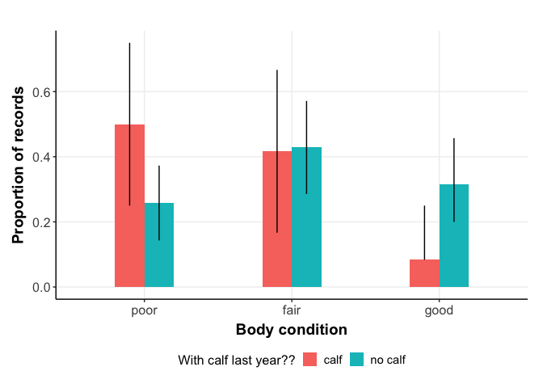
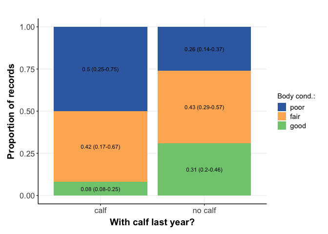
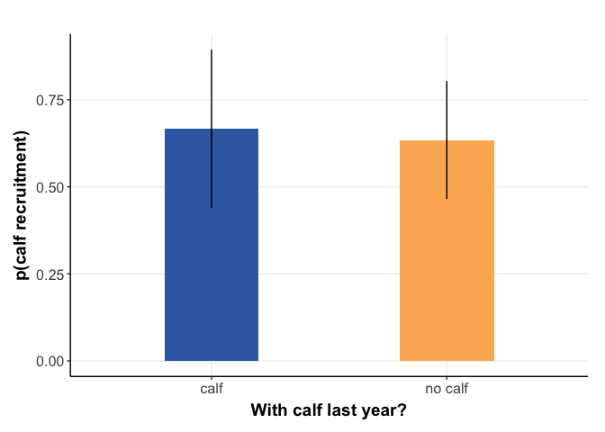

Nutritional Hyopothesis: Klinse-Za Caribou
================
Clayton T. Lamb, PhD, UBCO
03 June, 2021

\#\#\#Check body condition based on whether female had a calf the year
before

\#\#Load Data

``` r
library(here)
library(lme4)
library(sjPlot)
library(MuMIn)
library(ggpubr)
library(forcats)
library(huxtable)
library(knitr)
library(tidyverse)


##ggplot color/fillscales
scale_fill_Publication <- function(...){
  library(scales)
  discrete_scale("fill","Publication",manual_pal(values = c("#386cb0","#fdb462","#7fc97f","#ef3b2c","#662506","#a6cee3","#fb9a99","#984ea3","#ffff33")), ...)
}
scale_colour_Publication <- function(...){
  library(scales)
  discrete_scale("colour","Publication",manual_pal(values = c("#386cb0","#fdb462","#7fc97f","#ef3b2c","#662506","#a6cee3","#fb9a99","#984ea3","#ffff33")), ...)
}
##custom ggplot theme
theme_Publication <- function(...){
  theme_bw()+
  theme(plot.title = element_text(face = "bold",
                                  size = rel(1.2), hjust = 0.5),
        text = element_text(),
        panel.background = element_rect(colour = NA),
        plot.background = element_rect(colour = NA),
        panel.border = element_rect(colour = NA),
        axis.title = element_text(face = "bold",size = rel(1.3)),
        axis.title.y = element_text(angle=90,vjust =2),
        axis.title.x = element_text(vjust = -0.2),
        axis.text = element_text(size = rel(1.1)), 
        axis.line = element_line(colour="black"),
        axis.ticks = element_line(),
        panel.grid.major = element_line(colour="#f0f0f0"),
        panel.grid.minor = element_blank(),
        legend.key = element_rect(colour = NA),
        legend.position = "bottom",
        legend.direction = "horizontal",
        legend.key.size= unit(0.5, "cm"),
        legend.spacing = unit(0.05, "cm"),
        legend.text = element_text(size = rel(1)),
        legend.title = element_blank(),
        plot.margin=unit(c(10,5,5,5),"mm"),
        strip.background=element_rect(colour="#f0f0f0",fill="#f0f0f0"),
        strip.text = element_text(face="bold",
                                  size = rel(1.1)))
}

##load data
cap <- read_csv(here::here("NutritionalHypothesis", "data","KZONCP_Health_Year2_results_200203.csv"))
df <- read_csv(here::here("NutritionalHypothesis","data","SuccCalving.csv"))

##stack data
df$SRCLY14 <- NA
x14 <- df%>%select(ID, LOCCY14,SRCCY14,LOCLY14,SRCLY14)%>%
  mutate(Year=2014)
colnames(x14) <- c("ID","LOCCY","SRCCY", "LOCLY", "SRCLY", "Year")

x15 <- df%>%select(ID, LOCCY15,SRCCY15,LOCLY15,SRCLY15)%>%
  mutate(Year=2015)
colnames(x15) <- c("ID","LOCCY","SRCCY", "LOCLY", "SRCLY", "Year")

x16 <- df%>%select(ID, LOCCY16,SRCCY16,LOCLY16,SRCLY16)%>%
  mutate(Year=2016)
colnames(x16) <- c("ID","LOCCY","SRCCY", "LOCLY", "SRCLY", "Year")

x17 <- df%>%select(ID, LOCCY17,SRCCY17,LOCLY17,SRCLY17)%>%
  mutate(Year=2017)
colnames(x17) <- c("ID","LOCCY","SRCCY", "LOCLY", "SRCLY", "Year")

x18 <- df%>%select(ID, LOCCY18,SRCCY18,LOCLY18,SRCLY18)%>%
  mutate(Year=2018)
colnames(x18) <- c("ID","LOCCY","SRCCY", "LOCLY", "SRCLY", "Year")

x19 <- df%>%select(ID, LOCCY19,SRCCY19,LOCLY19,SRCLY19)%>%
  mutate(Year=2019)
colnames(x19) <- c("ID","LOCCY","SRCCY", "LOCLY", "SRCLY", "Year")

df <- rbind(x14,x15,x16,x17,x18,x19)

###Drop 999
df <- df%>%
  drop_na(SRCCY, SRCLY)%>%
  filter(SRCCY!=999,SRCLY!=999)

hist(df%>%pull(SRCLY))
```

<!-- -->

``` r
###Make calf survival binary
df <- df%>%
  mutate(SRCCY=case_when(SRCCY<300~0, SRCCY>=300~1, TRUE~NA_real_),
         SRCLY=case_when(SRCLY<300~0, SRCLY>=300~1, TRUE~NA_real_))

##drop na's
df <- df%>%
  drop_na()


##select data of interest
cap <- cap%>%
  select(`WII Animal ID`, Year, condition_clean)%>%
  filter(!condition_clean %in% "unk")%>%
  drop_na(condition_clean)

##where previous
bod.cond <- df%>%
  left_join(cap%>%rename(ID=`WII Animal ID`), by = c("ID", "Year"))%>%
  drop_na(condition_clean)
```

\#\#summarize and plot

``` r
##summarize and plot
bod.cond%>%
  mutate(SRCLY=case_when(SRCLY==1~"calf",SRCLY==0~"no calf"))%>%
  group_by(SRCLY, condition_clean)%>%
  summarise(n = n()) %>%
  group_by(SRCLY)%>%
  mutate(freq = n / sum(n),
         condition_clean=factor(condition_clean, levels=c("poor", "fair", "good")))%>%
  ungroup()%>%
  ggplot(aes(x=condition_clean, y=freq, fill=SRCLY)) + 
  geom_col(position = "dodge", width=0.4)+
  theme_Publication()+
  theme(legend.title=element_text(face = "bold",size = rel(1.3)))
```

<!-- -->

``` r
bod.cond%>%
  mutate(SRCLY=case_when(SRCLY==1~"calf",SRCLY==0~"no calf"))%>%
  group_by(SRCLY, LOCLY, condition_clean)%>%
  summarise(n = n()) %>%
  group_by(SRCLY, LOCLY)%>%
  mutate(freq = n / sum(n),
         condition_clean=factor(condition_clean, levels=c("poor", "fair", "good")))%>%
  ungroup()%>%
  ggplot(aes(x=condition_clean, y=freq, fill=SRCLY)) + 
  geom_col(position = "dodge", width=0.4)+
  theme_Publication()+
  theme(legend.title=element_text(face = "bold",size = rel(1.3)))+
  facet_grid(.~LOCLY)
```

<!-- -->

\#\#BOOTSTRAP

``` r
set.seed(2020)
sum.boot <- data.frame()
for(i in 1:1000){
  sum <-bod.cond%>%
    mutate(SRCLY=case_when(SRCLY==1~"calf",SRCLY==0~"no calf"))%>%
    group_by(SRCLY)%>%
    sample_frac(1, replace = TRUE)%>%
    group_by(SRCLY, condition_clean)%>%
    summarise(n = n()) %>%
    group_by(SRCLY)%>%
    mutate(freq = n / sum(n),
           condition_clean=factor(condition_clean, levels=c("poor", "fair", "good")),
           i=i)%>%
    ungroup()
  
  sum.boot <- rbind(sum.boot, sum)
}

bod.cond%>%
  mutate(SRCLY=case_when(SRCLY==1~"calf",SRCLY==0~"no calf"))%>%
  group_by(SRCLY, condition_clean)%>%
  summarise(n = n()) %>%
  group_by(SRCLY)%>%
  mutate(freq = n / sum(n),
         condition_clean=factor(condition_clean, levels=c("poor", "fair", "good")))%>%
  ungroup()%>%
  ggplot()+
  geom_col(aes(x=condition_clean, y=freq, fill=SRCLY),position = "dodge", width=0.4)+
  geom_linerange(data=sum.boot%>%
                   group_by(SRCLY, condition_clean)%>%
                   summarise(up=quantile(freq,0.95), low=quantile(freq,0.05), mean=mean(freq)),
                 aes(x=condition_clean, group=SRCLY,ymin=low, ymax=up), position = position_dodge(width=0.4))+
  theme_Publication()+
  xlab("Body condition")+
  ylab("Proportion of records")+
  labs(fill = "With calf last year??")+
  theme(legend.title=element_text(size = rel(1.1)))
```

<!-- -->

``` r
bod.cond%>%
  mutate(SRCLY=case_when(SRCLY==1~"calf",SRCLY==0~"no calf"))%>%
  group_by(SRCLY, condition_clean)%>%
  summarise(n = n()) %>%
  group_by(SRCLY)%>%
  mutate(freq = (n / sum(n))%>%round(2),
         condition_clean=factor(condition_clean, levels=c("poor", "fair", "good")))%>%
  ungroup()%>%
  left_join( sum.boot%>%
               group_by(SRCLY, condition_clean)%>%
               summarise(up=quantile(freq,0.95)%>%round(2), low=quantile(freq,0.05)%>%round(2)),
             by=c("SRCLY", "condition_clean"))%>%
  mutate(string=paste(freq, " (", low,"-",up,")",sep=""))%>%
  ggplot(aes(fill=condition_clean, y=freq, x=SRCLY, label=string)) + 
  geom_col()+
  geom_text(size=3,position = position_stack(vjust = 0.5))+
  theme_Publication()+
  xlab("With calf last year?")+
  ylab("Proportion of records")+
  labs(fill = "Body cond.:")+
  theme(legend.title=element_text(size = rel(1)),
        legend.position = "right",
        legend.direction = "vertical")+
  scale_colour_Publication()+
  scale_fill_Publication() -> bc

bc 
```

<!-- -->

``` r
ggsave(here::here( "plots", "body_condition.png"), width=4, height=5, units="in")
```

### Females who had a calf last year seem to be more in the poor/fair body conditions than in good, whereas no calf females have approximately equal proportions of poor/fair/good

### Test whether females who had calves the year before, were less likely to have a calf the following year

\#\#proportion of free vs penned w/ calves

``` r
df%>%
  group_by(LOCCY)%>%
  summarise(prop.calf=mean(SRCLY))


##boot error bands
prop.error <- data.frame()

for(i in 1: 1000){
a <- df%>%
  sample_frac(1, replace=TRUE)%>%
  group_by(LOCCY)%>%
  summarise(prop.calf=mean(SRCLY))%>%
  mutate(i=i)%>%
  rbind(prop.error)->prop.error
}

prop.error%>%
  group_by(LOCCY)%>%
  summarise(mean=mean(prop.calf),
            upper=quantile(prop.calf,0.95),
            lower=quantile(prop.calf,0.05))

into <- ggplot(prop.error%>%mutate(LOCCY=case_when(LOCCY%in%"Fre"~"Free", TRUE~LOCCY)),
       aes(x=LOCCY, y=prop.calf, fill=LOCCY))+
   geom_violin(alpha=0.8)+
  #geom_jitter(alpha=0.2, size=0.4, aes(color=LOCCY))+
  theme_Publication()+
  ylim(0,1)+
  scale_colour_Publication()+
  scale_fill_Publication()+
  theme(legend.position = "none")+
  ylab("Proportion with calf last year")+
  xlab("Location current year")

into
```

<!-- -->

``` r
ggsave(here::here( "plots", "into_pen.png"), width=4, height=4, units="in")
```

\#\#Run GLMM Models

``` r
df <- df%>%
  mutate(SRCLY=as.character(SRCLY))


m1 <- glmer(SRCCY ~  SRCLY + (1|ID) + (1|Year), 
            data = df,
            family = "binomial")

m2 <- glmer(SRCCY ~  LOCLY+SRCLY+ (1|ID) + (1|Year), 
            data = df,
            family = "binomial")

m3 <- glmer(SRCCY ~  LOCCY + LOCLY*SRCLY + (1|ID) + (1|Year), 
            data = df,
            family = "binomial")

m4 <- glmer(SRCCY ~  LOCCY + (1|ID) + (1|Year), 
            data = df,
            family = "binomial")

m5 <- glmer(SRCCY ~  LOCCY + (1|ID), 
            data = df,
            family = "binomial")

m6 <- glmer(SRCCY ~  SRCLY + (1|ID), 
            data = df,
            family = "binomial")


model.sel(m1,m2,m3,m4,m5,m6)
```

\#\#\#IS GLMM needed?

``` r
m5l <- glm(SRCCY ~   LOCCY,
           data = df,
           family = "binomial")

###plot
a <- plot_model( 
  m5,
  title = "",
  colors = "red")+
  geom_hline(yintercept = 1, linetype="dotted")+
  theme_Publication()+
  ggtitle("GLMM")

b <- plot_model( 
  m5l,
  title = "",
  colors = "red")+
  geom_hline(yintercept = 1, linetype="dotted")+
  theme_Publication()+
    ggtitle("GLM")

ggarrange(a,b)
```

<!-- -->

\#\#\#GLM produces the same results, go with simpler GLM approach

\#\#GLM

``` r
m1 <- glm(SRCCY ~  SRCLY, 
            data = df,
            family = "binomial")

m2 <- glm(SRCCY ~  LOCLY+SRCLY, 
            data = df,
            family = "binomial")

m3 <- glm(SRCCY ~  LOCCY + LOCLY*SRCLY, 
            data = df,
            family = "binomial")

m4 <- glm(SRCCY ~  LOCCY + LOCLY + SRCLY, 
          data = df,
          family = "binomial")

m5 <- glm(SRCCY ~  LOCCY, 
            data = df,
            family = "binomial")

m6 <- glm(SRCCY ~  LOCCY + LOCLY, 
            data = df,
            family = "binomial")

mod.sel <- model.sel(m1,m2,m3,m4,m5,m6)
mod.avg <- model.avg(mod.sel)

# replace Model name with formulas 
for(i in 1:nrow(mod.sel)) {mod.sel$Model[i]<- as.character(formula(get(paste(rownames(mod.sel)[i]))))[3] }

mod.sel <- mod.sel%>%tibble%>%
  dplyr::select(Model,df,AICc,delta, weight)%>%
  rename(dAICc=delta)%>%
  mutate_if(is.numeric, function(x) round(x, 2))%>%
  as_hux(add_colnames = TRUE,
         scientific=FALSE)%>%
  theme_article()%>%
  set_col_width(c(4,0.5,1,0.9,0.7))%>%
  set_width(0.6)

huxtable::number_format(mod.sel)[, 3] <- list(
  function(x)
    prettyNum(x, big.mark = ",",
              scientific = FALSE)
)
huxtable::number_format(mod.sel)[, 4] <- list(
  function(x)
    prettyNum(x, big.mark = ",",
              scientific = FALSE)
)
```

``` r
kable(mod.sel[-1,], espace=FALSE)
```

|     | Model                  | df | AICc   | dAICc | weight |
| :-- | :--------------------- | :- | :----- | :---- | :----- |
| 1.1 | LOCCY                  | 2  | 114.2  | 0     | 0.39   |
| 2   | LOCCY + LOCLY          | 3  | 114.46 | 0.27  | 0.34   |
| 3   | LOCCY + LOCLY + SRCLY  | 4  | 115.72 | 1.53  | 0.18   |
| 4   | LOCCY + LOCLY \* SRCLY | 5  | 117.63 | 3.43  | 0.07   |
| 5   | LOCLY + SRCLY          | 3  | 123.03 | 8.83  | 0      |
| 6   | SRCLY                  | 2  | 124.29 | 10.1  | 0      |

\#\#\#AIC shows that the LOCCY only has most support

\#\#Predict Responses of top model with SRCLY in it to visualize effect

``` r
pred <- expand.grid(LOCLY="Fre", SRCLY=c(1,0)%>%as.character(), LOCCY="Pen")
pred$pred <- predict(mod.avg, newdata = pred, type="response")
pred$pred.se <- predict(mod.avg, newdata = pred, type="response", se.fit=TRUE)$se.fit
pred <- pred%>%mutate(SRCLY=case_when(SRCLY==1~"calf",SRCLY==0~"no calf"))

c <-ggplot() + 
  geom_col(data=pred, aes(x=SRCLY, y=pred, fill=SRCLY),position = "dodge", width=0.4)+
  geom_linerange(data=pred,
                 aes(x=SRCLY, group=SRCLY,ymin=pred-(pred.se*1.96), ymax=pred+(pred.se*1.96)), position = position_dodge(width=0.4))+
  theme_Publication()+
  xlab("With calf last year?")+
  ylab("p(calf recruitment)")+
  theme(legend.position='none')+
  scale_fill_Publication()

c
```

<!-- -->

``` r
ggsave(here::here( "plots", "SRCCY_SRCLY.png"), width=4, height=4, units="in")
```

\#\#plot together

``` r
ggarrange(into, bc, c,
          ncol = 2, nrow = 2,
          labels=c("A", "B", "C"))
```

<!-- -->

``` r
ggsave(here::here( "plots", "nutr_hyp_together.png"), width=10, height=9, units="in")
```

\#\#Another Approach- test the expected vs observed frequencies of
observations

``` r
####BY CLASS
df <- read_csv(here::here("NutritionalHypothesis","data", "reprohist.csv"))

###count up ones that fit nutr hyp
new<-data.frame()
for(i in 1:nrow(df)){
  a <- df[i,]
  z <- c()
  for(j in 2:ncol(df)){
    if(!any(is.na(c(a[,j-1],a[,j])))){
         if(a[,j-1]>14 & a[,j]<=14){
          z[j-1] <- "calf-no calf"
        }
        if(a[,j-1]<=14 & a[,j]>14){
          z[j-1] <- "no calf-calf"
        }
        if(a[,j-1]<=14 & a[,j]<=14){
          z[j-1] <- "no calf-no calf"
        }
        if(a[,j-1]>14 & a[,j]>14){
          z[j-1] <- "calf-calf"
        }
    }
    if(any(is.na(c(a[,j-1],a[,j])))){
      z[j-1] <- NA
    }
  }
  new <- rbind(new,tibble(i=i%>%as.character(), z=z))
}


raw <- new%>%drop_na(z)%>%group_by(z)%>%summarise(n = n())%>%mutate(freq = n / sum(n))

###create random distribution
count <-data.frame()
for(i in 1:1000){
  df2 <- df[,sample(ncol(df))]
  
  new<-data.frame()
  for(i in 1:nrow(df2)){
    a <- df2[i,]
    z <- c()
    for(j in 2:ncol(df2)){
      if(!any(is.na(c(a[,j-1],a[,j])))){
        if(a[,j-1]>14 & a[,j]<=14){
          z[j-1] <- "calf-no calf"
        }
        if(a[,j-1]<=14 & a[,j]>14){
          z[j-1] <- "no calf-calf"
        }
        if(a[,j-1]<=14 & a[,j]<=14){
          z[j-1] <- "no calf-no calf"
        }
        if(a[,j-1]>14 & a[,j]>14){
          z[j-1] <- "calf-calf"
        }
      }
      if(any(is.na(c(a[,j-1],a[,j])))){
        z[j-1] <- NA
      }
    }
    new <- rbind(new,tibble(i=i%>%as.character(), z=z))
  }
  
  
  new%>%group_by(i)%>%summarize(mean=mean(z, na.rm=TRUE))
  
  new%>%summarize(mean=mean(z, na.rm=TRUE))
  
  count <- rbind(count, tibble(i=i, new%>%drop_na(z)%>%group_by(z)%>%summarise(n = n())%>%mutate(freq = n / sum(n))
                                 )
                  )
}

count%>%group_by(z)%>%summarize(mean=mean(freq))

p <- tibble(p=c(sum((count%>%filter(z=="calf-calf")%>%pull(freq))<0.241)/1000,
                sum((count%>%filter(z=="calf-no calf")%>%pull(freq))>0.320)/1000,
                sum((count%>%filter(z=="no calf-calf")%>%pull(freq))>0.310)/1000,
                sum((count%>%filter(z=="no calf-no calf")%>%pull(freq))<0.126)/1000),
            z=c("calf-calf","calf-no calf","no calf-calf","no calf-no calf"),
            freq=0.4,
            y=60)

p <- p%>%
  mutate(p=paste("p",p,sep="="))


ggplot(data=count%>%drop_na(z), aes(x=freq))+
  geom_histogram(fill="grey")+
  theme_Publication()+
  xlim(0.05,0.45)+
  scale_fill_Publication()+
  facet_wrap(vars(z), scales = "free_x")+
  geom_vline(data = count%>%group_by(z)%>%summarize(mean=mean(freq)), aes(xintercept=mean))+ 
  geom_vline(data =raw%>%drop_na(z) , aes(xintercept=freq), linetype="dashed")+
  geom_text(data=p, aes(label=p,y=y))+
  labs(title="Expected (random) distributions for calf survival (previous year-current year)",
       x="Frequency",
       y="Count")
```

<!-- -->

``` r
ggsave(here::here( "plots", "nutr_hyp_null.png"), width=9, height=7, units="in")
```
