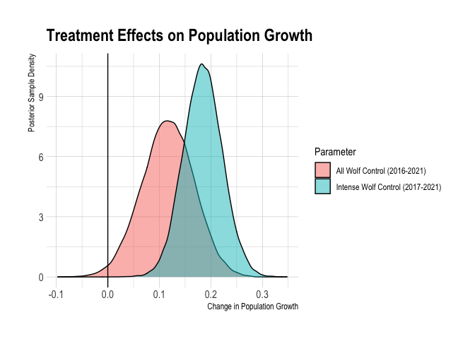

Klinse-Za Caribou IPM
================
Sara Williams, Hans Martin, and Clayton Lamb
14 May, 2021

\#\#\#Check body condition based on whether female had a calf the year
before

\#\#Load Data

``` r
library(ggmcmc)
library(jagsUI)
library(knitr)
library(gt)
library(ggallin)
library(hrbrthemes)
library(tidyverse)
library(rjags)
library(MCMCvis)
library(here)

##define fn
gm_mean = function(a){prod(a)^(1/length(a))}


# Read in raw data
adult_female_survival <- read.csv(here::here("data", "QT", "adult_female_survival_QT.csv"))
adult_female_recruit <- read.csv(here::here("data", "QT", "adult_female_recruit_QT.csv"))

adult_sex_ratio <- read.csv(here::here("data", "QT", "adult_sexratio_QT.csv"))


count_dat <- read_xlsx(here::here("data", "QT", "Count_summary_QT.xlsx"))%>%
  mutate_at(c("SurveryCount_ADULTMF","SurveryCount_CALFMF", "Estimate_ADULTMF","Estimate_CALFMF"), funs(round(., 0)))

##remove 2019 est
##significant evidence that this is a poor estimate of population abundance
##min count was 34% > than the sightability corrected survey count.
count_dat[19,"Estimate_ADULTMF"] <- NA
count_dat[19,"SD_Estimate_ADULTMF"] <- NA
count_dat[19,"Estimate_CALFMF"] <- NA
count_dat[19,"SD_Estimate_CALFMF"] <- NA

count_dat[19,"SurveryCount_ADULTMF"] <- NA
count_dat[19,"SurveryCount_CALFMF"] <- NA

sightability <- read.csv(here::here("data", "QT", "sightability_QT.csv"))
```

\#\#Prep sightability bootstrap

\#\#Prep for IPM

``` r
#  Years of study
yrs <-  seq(from = 2001, to = 2021, by = 1)
nyr <- length(yrs)
yr_idx <- seq(from = 1, to = nyr, by = 1)
yr_df <- as.data.frame(cbind(yrs, yr_idx))


#  Create vectors of sex ratio
adult_sex_ratio <- adult_sex_ratio$Mean


#  Recruitment 
adult_female_recruit <- adult_female_recruit%>% mutate(
      Mean=Mean/2,
      SD=SD/2)

meanr <- array(NA, c(3,1,2)) 
meanr[3,1,1] <- mean(adult_female_recruit$Mean, na.rm = TRUE)
meanr[3,1,2] <- 0.01


# Survival - need estimates for both penned and control (not penned) population units
#  Survival rate is assumed the same across subadult 1, subadult 2 and adult
means <- array(NA, c(3,1,2))

adult_female_survival_control <- adult_female_survival %>%
    dplyr::filter(Pop == 1) 

means[2:3,1,1] <- mean(adult_female_survival_control$Mean, na.rm = TRUE)
means[2:3,1,2] <- 0.01


# Starting population size of population unit (vector of values for each age class)
n1 <- numeric()
n1[1] <- count_dat$Estimate_CALFMF[2]*.5
n1[2] <- count_dat$Estimate_ADULTMF[2]*.15*count_dat$SexRatio[2]
n1[3] <- count_dat$Estimate_ADULTMF[2]*.85*count_dat$SexRatio[2]


#  Survival estimates by year of penned and control (not penned) population units separately
sdat <- adult_female_survival %>%
    mutate(dau = 1, 
        age = 3,
        pop = Pop,
        mu = ifelse(Mean!= 1, Mean, 0.99),
        tau = 1/ (SD * SD)) %>%
    dplyr::filter(!is.na(mu)) %>%
    left_join(yr_df, by = c("Year" = "yrs")) %>%
    dplyr::select(dau, yr = yr_idx, age, pop, mu, tau)
sdat$tau[sdat$tau == "Inf"] <- mean(sdat$tau[!is.infinite(sdat$tau)])
ns <- nrow(sdat)    


#  Recruitment estimates by year of control (not penned) population unit
rdat <- adult_female_recruit  %>%
    mutate(dau = 1, 
        age = NA,
        pop = Pop,
        mu = Mean,
        tau = 1/ (SD * SD)) %>%
    dplyr::filter(!is.na(mu)) %>%
    left_join(yr_df, by = c("Year" = "yrs")) %>%
    dplyr::select(dau, yr = yr_idx, age, pop, mu, tau) 
nr <- nrow(rdat)    


#  Minium counts of all individuals (only females in this set up) combined over penned and control (not penned) 
#   population units 
mindat <- count_dat %>%
    mutate(dau = 1, 
        age = NA,
        pop = NA,
        mu = SurveryCount_ADULTMF,
        tau = NA) %>%
    dplyr::filter(mu > 4) %>%
    left_join(yr_df, by = c("Year" = "yrs")) %>%
    dplyr::select(dau, yr = yr_idx, age, pop, mu, tau)

calf_mindat <- count_dat %>%
    mutate(dau = 1, 
        age = NA,
        pop = NA,
        mu = SurveryCount_CALFMF,
        tau = NA) %>%
    dplyr::filter(mu > 4) %>%
    left_join(yr_df, by = c("Year" = "yrs")) %>%
    dplyr::select(dau, yr = yr_idx, age, pop, mu, tau) 
nmin <- nrow(mindat)

abundat <- count_dat %>%
    mutate(dau = 1, 
        age = NA,
        pop = NA,
        mu = Estimate_ADULTMF,
        tau = 1/(SD_Estimate_ADULTMF * SD_Estimate_ADULTMF)) %>%
    dplyr::filter(mu > 4) %>%
    left_join(yr_df, by = c("Year" = "yrs")) %>%
    dplyr::select(dau, yr = yr_idx, age, pop, mu, tau) 
na <- nrow(abundat)

calf_abundat <- count_dat %>%
    mutate(dau = 1, 
        age = NA,
        pop = NA,
        mu = Estimate_CALFMF,
        tau = 1/(SD_Estimate_CALFMF * SD_Estimate_CALFMF)) %>%
    dplyr::filter(mu > 4) %>%
    left_join(yr_df, by = c("Year" = "yrs")) %>%
    dplyr::select(dau, yr = yr_idx, age, pop, mu, tau) 
```

## Run model in JAGS

``` r
#  Gather data inputs in a list
ipm_dat <- list(nyr = nyr,
    nmin = nmin,
    ns = ns,
    nr = nr,
    na = na,
    #wolfpen_ind = wolfpen_ind,
    means = means,
    meanr = meanr,
    n1 = n1, 
    adult_sex_ratio = adult_sex_ratio,
    mindat = mindat, 
    calf_mindat = calf_mindat, 
    abundat = abundat,
    calf_abundat = calf_abundat,
    sdat = sdat, 
    rdat = rdat)


#  Initial values for N to avoid parent node erros
Nst <- array(10, c(nyr,3,1))
ipm_inits <- function(){ 
        list(N = Nst)}
    
    
#  Model parameters to monitor
model_parms <- c("lambda","logla",
    "totN", "N", "S", "R", "r1", "r2", 
    #"wolfpen_eff_r", "wolfpen_eff_s",
    "sa_yr", "r_yr", 
    "totCalves", "totAdults",   
    "totAdultsMF", "totCalvesMF", "totNMF",
    "geom_mean_lambda",
    "geom_mean_lambda_pre", "geom_mean_lambda_post",
    "diff_geom_mean_lambda_post_to_pre","diff_geom_mean_lambda_post_to_pre_iwolf",
    "geom_mean_lambda_post_iwolf",
    "mean_surv_pre", "mean_surv_post",
    "mean_r_pre", "mean_r_post",
    "mean_r3_pre", "mean_r3_post")


nt <- 3
nb <- 8000
nc <- 3
nad <- 5000
ni <- 50000

out_rnd_eff <- jagsUI::jags(ipm_dat, 
    inits = ipm_inits,
    model_parms,
    model.file = here::here("jags","QT_IPM_rnd_eff_w_abund_and_mincount_CL.txt"),
    n.chains = nc, 
    n.iter = ni,
    n.burnin = nb,
    n.thin = nt,
    n.adapt = nad)

save(out_rnd_eff, file = here::here("output", "qt_out_rnd_eff.Rdata"))
```

\#\#MODEL DIAGNOSTICS

``` r
MCMCtrace(out_rnd_eff, 
        params = "totAdult",
        ISB = FALSE,
        pdf = FALSE)

MCMCtrace(out_rnd_eff, 
        params = "r1",
        ISB = FALSE,
        pdf = FALSE)

MCMCtrace(out_rnd_eff, 
        params = "R",
        ISB = FALSE,
        pdf = FALSE)


MCMCtrace(out_rnd_eff, 
        params = "lambda",
        ISB = FALSE,
        pdf = FALSE)

MCMCsummary(out_rnd_eff)%>%filter(n.eff<400)
```

\#\#ABUNDANCE

``` r
res_df <- data.frame(rbind(yr_df,yr_df),
                     est=c(out_rnd_eff$mean$totN, out_rnd_eff$mean$lambda),
                     q2.5=c(out_rnd_eff$q2.5$totN, out_rnd_eff$q2.5$lambda),
                     q97.5=c(out_rnd_eff$q97.5$totN, out_rnd_eff$q97.5$lambda),
                     param=rep(c("totN", "Lambda"), each=nyr))

res_df <- res_df[-(nyr+1),]

ggplot(res_df,aes(x = yrs, y = est, ymin=q2.5, ymax=q97.5, fill=param)) +
  geom_cloud(steps=20, max_alpha = 1,se_mult=1.96)+
  geom_line() +
  geom_point() +
  theme_ipsum()+
  theme(legend.position = "none")+
  ylab("Estimate")+
  xlab("Year")+
  facet_wrap(vars(param), scales="free_y")+
  geom_vline(xintercept = 2016.5)+
  labs(x="Year",title="Population Growth Trajectory")
```

<!-- -->

``` r
res_df%>%rbind(data.frame(rbind(yr_df),
                          est=c(out_rnd_eff$mean$totNMF),
                          q2.5=c(out_rnd_eff$q2.5$totNMF),
                          q97.5=c(out_rnd_eff$q97.5$totNMF),
                          param=rep(c("totNMF"), each=nyr)))%>%
  filter(param!="Lambda")%>%
  ggplot(aes(x = yrs, y = est, ymin=q2.5, ymax=q97.5, fill=param)) +
  geom_cloud(steps=20, max_alpha = 1,se_mult=1.96)+
  geom_line() +
  geom_point() +
  theme_ipsum()+
  theme(legend.position = "none")+
  ylab("Estimate")+
  xlab("Year")+
  facet_wrap(vars(param), scales="free_y")+
  geom_vline(xintercept = 2016.5)+
    labs(x="Year",title="Population Abundance and Trajectory")+
  expand_limits(y=0)
```

<!-- -->

``` r
#ggsave(here::here("plots", "abundance_MF.png"), width=5, height=8)
```

\#\#GROUP SPECIFIC VITAL RATES

``` r
#R
pop_df_r <- data.frame(estimate=out_rnd_eff$mean$R,
                       lower=out_rnd_eff$q2.5$R,
                       upper=out_rnd_eff$q97.5$R,
                       pop=rep(c("Free"), each=nyr),
                       param="Recruitment",
                       yrs=rep(yrs, times=1))%>%
  mutate(lower=case_when(lower<0~0,
                         TRUE~lower))

#S
pop_df_s <- data.frame(estimate=c(out_rnd_eff$mean$S),
                       lower=c(out_rnd_eff$q2.5$S),
                       upper=c(out_rnd_eff$q97.5$S),
                       pop=rep(c("Free"), each=nyr),
                       param="Survival",
                       yrs=rep(yrs, times=1))


# pop_df <- data.frame(estimate=pop_df_s$estimate/(1-pop_df_r$estimate),
#                      lower=pop_df_s$lower/(1-pop_df_r$lower),
#                      upper=pop_df_s$upper/(1-pop_df_r$upper),
#                      pop=rep(c("Free", "Pen"), each=nyr),
#                      yrs=rep(yrs, times=2))

pop_df <- data.frame(estimate=pop_df_s$estimate+pop_df_r$estimate,
                     lower=pop_df_s$lower+pop_df_r$lower,
                     upper=pop_df_s$upper+pop_df_r$upper,
                     pop=rep(c("Free"), each=nyr),
                     yrs=rep(yrs, times=1))

pop_df2 <- rbind(pop_df_r, pop_df_s)

ggplot(data=pop_df2%>%
         filter(yrs>2000),
       aes(x = yrs, y = estimate, fill=pop,ymin=lower, ymax=upper)) +
  geom_line(aes(color=pop)) +
  #geom_cloud(aes( ymin=lower, ymax=upper),steps=20, max_alpha = 1,se_mult=1.96)+
  geom_ribbon(alpha=0.4)+
  theme_ipsum()+
  labs(x="Year", y="Rate", title="Annual vital rates")+
  facet_wrap(vars(param), scales="free_y")+
    geom_vline(xintercept = 2016.5)
```

<!-- -->

``` r
#ggsave(here::here("plots", "vital_rates.png"), width=8, height=5)
```

\#\#COMPARE TO RAW VITAL RATE DATA

``` r
calc.vr <- pop_df2%>%
         filter(yrs>2001)

raw.vr <- rbind(adult_female_survival%>%mutate(param="Survival",
                                         pop=case_when(Pop_desc%in%"Control"~"Free",TRUE~as.character(Pop_desc)),
                                         estimate=Mean,
                                         lower=NA,
                                         upper=NA,
                                         yrs=Year)%>%
  dplyr::select(estimate,lower,upper,pop,param,yrs),  ###ADD AFS
  
  adult_female_recruit%>%mutate(param="Recruitment",
                                         pop=case_when(Pop_desc%in%"Control"~"Free",TRUE~as.character(Pop_desc)),
                                         estimate=Mean,
                                         lower=NA,
                                         upper=NA,
                                         yrs=Year)%>%
   dplyr::select(estimate,lower,upper,pop,param,yrs))  ###ADD FREE RECRUIT
  
          
  
calc.vr%>%mutate(class="modelled")%>%
  rbind(raw.vr%>%mutate(class="raw"))%>%
ggplot(aes(x = yrs, y = estimate, fill=class,ymin=lower, ymax=upper)) +
  #geom_cloud(steps=20, max_alpha = 1,se_mult=1.96)+
    geom_ribbon(alpha=0.4)+
  geom_line(aes(color=class)) +
  theme_ipsum()+
  theme_ipsum()+
  labs(x="Year", y="Rate", title="Comparing modelled vs raw vital rate")+
  facet_wrap(vars(param,pop), scales="free_y")+
    geom_vline(xintercept = 2016.5)
```

<!-- -->

``` r
#ggsave(here::here("plots", "QT_vital_ratesfit.png"), width=8, height=5)

write_csv(raw.vr, here::here("data", "QT", "vitalrate_validation_QT.csv"))
```

\#\#COMPARE TO RAW COUNT DATA

``` r
calc.abund <- data.frame(rbind(yr_df),
                          est=c(out_rnd_eff$mean$totAdults),
                          q2.5=c(out_rnd_eff$q2.5$totAdults),
                          q97.5=c(out_rnd_eff$q97.5$totAdults),
                          param=rep(c("TotN"), each=nyr))


raw.abund <-count_dat%>%mutate(param="TotN",
                                         est=Estimate_ADULTMF*.64,
                                         q2.5=NA,
                                         q97.5=NA,
                                         yrs=Year,
                                         yr_idx=NA)%>%
  select(colnames(calc.abund))%>%
mutate(param="TotN")

out_rnd_eff$mean$totNMF[19]
out_rnd_eff$q2.5$totNMF[19]
out_rnd_eff$q97.5$totNMF[19]


calc.abund%>%mutate(class="modelled")%>%
  rbind(raw.abund%>%as.data.frame()%>%mutate(class="observed"))%>%
ggplot(aes(x = yrs, y = est, fill=class)) +
    geom_cloud(aes( ymin=q2.5, ymax=q97.5),steps=20, max_alpha = 1,se_mult=1.96)+
  geom_line(aes(color=class)) +
  geom_point(aes(color=class)) +
  theme_ipsum()+
  theme_ipsum()+
  labs(x="Year", y="Abundance", title="Comparing modelled vs raw abundance")+
    geom_vline(xintercept = 2016.5)+
  expand_limits(y=0)
```

<!-- -->

\#\#Summarize vital rates

``` r
summary.s <- tribble(
  ~pop,~s, ~s.lower, ~s.upper,
"pre-mgmt",out_rnd_eff$mean$mean_surv_pre, out_rnd_eff$q2.5$mean_surv_pre,out_rnd_eff$q97.5$geom_mean_lambda_pre,
"post-mgmt", out_rnd_eff$mean$mean_surv_post, out_rnd_eff$q2.5$mean_surv_post, out_rnd_eff$q97.5$mean_surv_post)


summary.r <- tribble(
  ~pop,~r, ~r.lower, ~r.upper,
"pre-mgmt",out_rnd_eff$mean$mean_r_pre, out_rnd_eff$q2.5$mean_r_pre, out_rnd_eff$q97.5$mean_r_pre,
"post-mgmt", out_rnd_eff$mean$mean_r_post, out_rnd_eff$q2.5$mean_r_post, out_rnd_eff$q97.5$mean_r_post)

summary.r3 <- tribble(
  ~pop,~r.ad, ~r.ad.lower, ~r.ad.upper,
"pre-mgmt", out_rnd_eff$mean$mean_r3_pre, out_rnd_eff$q2.5$mean_r3_pre, out_rnd_eff$q97.5$mean_r3_pre,
"post-mgmt", out_rnd_eff$mean$mean_r3_post, out_rnd_eff$q2.5$mean_r3_post, out_rnd_eff$q97.5$mean_r3_post)

summary.vr <- summary.s%>%
  left_join(summary.r)%>%
  mutate_if(is.numeric,function(x) round(x,2))
```

    ## Joining, by = "pop"

``` r
summary.vr <- summary.s%>%
  left_join(summary.r)%>%
  left_join(summary.r3)%>%
  mutate_if(is.numeric,function(x) round(x,2))
```

    ## Joining, by = "pop"
    ## Joining, by = "pop"

``` r
summary.vr$Years <- c("2002-2015", "2016-2021")

summary.vr <- summary.vr%>%
  mutate(`s 95% CI`=paste(s.lower,s.upper, sep="-"),
         `r 95% CI`=paste(r.lower,r.upper, sep="-"),
         `r.ad 95% CI`=paste(r.ad.lower,r.ad.upper, sep="-"))%>%
  select(pop, Years, s,`s 95% CI`, r,`r 95% CI`,r.ad,`r.ad 95% CI`)

gt(summary.vr)%>%
  tab_header(
    title = md("Vital Rates")
  ) 
```

<!--html_preserve-->

<style>html {
  font-family: -apple-system, BlinkMacSystemFont, 'Segoe UI', Roboto, Oxygen, Ubuntu, Cantarell, 'Helvetica Neue', 'Fira Sans', 'Droid Sans', Arial, sans-serif;
}

#ukbhoqpbmu .gt_table {
  display: table;
  border-collapse: collapse;
  margin-left: auto;
  margin-right: auto;
  color: #333333;
  font-size: 16px;
  font-weight: normal;
  font-style: normal;
  background-color: #FFFFFF;
  width: auto;
  border-top-style: solid;
  border-top-width: 2px;
  border-top-color: #A8A8A8;
  border-right-style: none;
  border-right-width: 2px;
  border-right-color: #D3D3D3;
  border-bottom-style: solid;
  border-bottom-width: 2px;
  border-bottom-color: #A8A8A8;
  border-left-style: none;
  border-left-width: 2px;
  border-left-color: #D3D3D3;
}

#ukbhoqpbmu .gt_heading {
  background-color: #FFFFFF;
  text-align: center;
  border-bottom-color: #FFFFFF;
  border-left-style: none;
  border-left-width: 1px;
  border-left-color: #D3D3D3;
  border-right-style: none;
  border-right-width: 1px;
  border-right-color: #D3D3D3;
}

#ukbhoqpbmu .gt_title {
  color: #333333;
  font-size: 125%;
  font-weight: initial;
  padding-top: 4px;
  padding-bottom: 4px;
  border-bottom-color: #FFFFFF;
  border-bottom-width: 0;
}

#ukbhoqpbmu .gt_subtitle {
  color: #333333;
  font-size: 85%;
  font-weight: initial;
  padding-top: 0;
  padding-bottom: 4px;
  border-top-color: #FFFFFF;
  border-top-width: 0;
}

#ukbhoqpbmu .gt_bottom_border {
  border-bottom-style: solid;
  border-bottom-width: 2px;
  border-bottom-color: #D3D3D3;
}

#ukbhoqpbmu .gt_col_headings {
  border-top-style: solid;
  border-top-width: 2px;
  border-top-color: #D3D3D3;
  border-bottom-style: solid;
  border-bottom-width: 2px;
  border-bottom-color: #D3D3D3;
  border-left-style: none;
  border-left-width: 1px;
  border-left-color: #D3D3D3;
  border-right-style: none;
  border-right-width: 1px;
  border-right-color: #D3D3D3;
}

#ukbhoqpbmu .gt_col_heading {
  color: #333333;
  background-color: #FFFFFF;
  font-size: 100%;
  font-weight: normal;
  text-transform: inherit;
  border-left-style: none;
  border-left-width: 1px;
  border-left-color: #D3D3D3;
  border-right-style: none;
  border-right-width: 1px;
  border-right-color: #D3D3D3;
  vertical-align: bottom;
  padding-top: 5px;
  padding-bottom: 6px;
  padding-left: 5px;
  padding-right: 5px;
  overflow-x: hidden;
}

#ukbhoqpbmu .gt_column_spanner_outer {
  color: #333333;
  background-color: #FFFFFF;
  font-size: 100%;
  font-weight: normal;
  text-transform: inherit;
  padding-top: 0;
  padding-bottom: 0;
  padding-left: 4px;
  padding-right: 4px;
}

#ukbhoqpbmu .gt_column_spanner_outer:first-child {
  padding-left: 0;
}

#ukbhoqpbmu .gt_column_spanner_outer:last-child {
  padding-right: 0;
}

#ukbhoqpbmu .gt_column_spanner {
  border-bottom-style: solid;
  border-bottom-width: 2px;
  border-bottom-color: #D3D3D3;
  vertical-align: bottom;
  padding-top: 5px;
  padding-bottom: 6px;
  overflow-x: hidden;
  display: inline-block;
  width: 100%;
}

#ukbhoqpbmu .gt_group_heading {
  padding: 8px;
  color: #333333;
  background-color: #FFFFFF;
  font-size: 100%;
  font-weight: initial;
  text-transform: inherit;
  border-top-style: solid;
  border-top-width: 2px;
  border-top-color: #D3D3D3;
  border-bottom-style: solid;
  border-bottom-width: 2px;
  border-bottom-color: #D3D3D3;
  border-left-style: none;
  border-left-width: 1px;
  border-left-color: #D3D3D3;
  border-right-style: none;
  border-right-width: 1px;
  border-right-color: #D3D3D3;
  vertical-align: middle;
}

#ukbhoqpbmu .gt_empty_group_heading {
  padding: 0.5px;
  color: #333333;
  background-color: #FFFFFF;
  font-size: 100%;
  font-weight: initial;
  border-top-style: solid;
  border-top-width: 2px;
  border-top-color: #D3D3D3;
  border-bottom-style: solid;
  border-bottom-width: 2px;
  border-bottom-color: #D3D3D3;
  vertical-align: middle;
}

#ukbhoqpbmu .gt_from_md > :first-child {
  margin-top: 0;
}

#ukbhoqpbmu .gt_from_md > :last-child {
  margin-bottom: 0;
}

#ukbhoqpbmu .gt_row {
  padding-top: 8px;
  padding-bottom: 8px;
  padding-left: 5px;
  padding-right: 5px;
  margin: 10px;
  border-top-style: solid;
  border-top-width: 1px;
  border-top-color: #D3D3D3;
  border-left-style: none;
  border-left-width: 1px;
  border-left-color: #D3D3D3;
  border-right-style: none;
  border-right-width: 1px;
  border-right-color: #D3D3D3;
  vertical-align: middle;
  overflow-x: hidden;
}

#ukbhoqpbmu .gt_stub {
  color: #333333;
  background-color: #FFFFFF;
  font-size: 100%;
  font-weight: initial;
  text-transform: inherit;
  border-right-style: solid;
  border-right-width: 2px;
  border-right-color: #D3D3D3;
  padding-left: 12px;
}

#ukbhoqpbmu .gt_summary_row {
  color: #333333;
  background-color: #FFFFFF;
  text-transform: inherit;
  padding-top: 8px;
  padding-bottom: 8px;
  padding-left: 5px;
  padding-right: 5px;
}

#ukbhoqpbmu .gt_first_summary_row {
  padding-top: 8px;
  padding-bottom: 8px;
  padding-left: 5px;
  padding-right: 5px;
  border-top-style: solid;
  border-top-width: 2px;
  border-top-color: #D3D3D3;
}

#ukbhoqpbmu .gt_grand_summary_row {
  color: #333333;
  background-color: #FFFFFF;
  text-transform: inherit;
  padding-top: 8px;
  padding-bottom: 8px;
  padding-left: 5px;
  padding-right: 5px;
}

#ukbhoqpbmu .gt_first_grand_summary_row {
  padding-top: 8px;
  padding-bottom: 8px;
  padding-left: 5px;
  padding-right: 5px;
  border-top-style: double;
  border-top-width: 6px;
  border-top-color: #D3D3D3;
}

#ukbhoqpbmu .gt_striped {
  background-color: rgba(128, 128, 128, 0.05);
}

#ukbhoqpbmu .gt_table_body {
  border-top-style: solid;
  border-top-width: 2px;
  border-top-color: #D3D3D3;
  border-bottom-style: solid;
  border-bottom-width: 2px;
  border-bottom-color: #D3D3D3;
}

#ukbhoqpbmu .gt_footnotes {
  color: #333333;
  background-color: #FFFFFF;
  border-bottom-style: none;
  border-bottom-width: 2px;
  border-bottom-color: #D3D3D3;
  border-left-style: none;
  border-left-width: 2px;
  border-left-color: #D3D3D3;
  border-right-style: none;
  border-right-width: 2px;
  border-right-color: #D3D3D3;
}

#ukbhoqpbmu .gt_footnote {
  margin: 0px;
  font-size: 90%;
  padding: 4px;
}

#ukbhoqpbmu .gt_sourcenotes {
  color: #333333;
  background-color: #FFFFFF;
  border-bottom-style: none;
  border-bottom-width: 2px;
  border-bottom-color: #D3D3D3;
  border-left-style: none;
  border-left-width: 2px;
  border-left-color: #D3D3D3;
  border-right-style: none;
  border-right-width: 2px;
  border-right-color: #D3D3D3;
}

#ukbhoqpbmu .gt_sourcenote {
  font-size: 90%;
  padding: 4px;
}

#ukbhoqpbmu .gt_left {
  text-align: left;
}

#ukbhoqpbmu .gt_center {
  text-align: center;
}

#ukbhoqpbmu .gt_right {
  text-align: right;
  font-variant-numeric: tabular-nums;
}

#ukbhoqpbmu .gt_font_normal {
  font-weight: normal;
}

#ukbhoqpbmu .gt_font_bold {
  font-weight: bold;
}

#ukbhoqpbmu .gt_font_italic {
  font-style: italic;
}

#ukbhoqpbmu .gt_super {
  font-size: 65%;
}

#ukbhoqpbmu .gt_footnote_marks {
  font-style: italic;
  font-size: 65%;
}
</style>

<div id="ukbhoqpbmu" style="overflow-x:auto;overflow-y:auto;width:auto;height:auto;">

<table class="gt_table">

<thead class="gt_header">

<tr>

<th colspan="8" class="gt_heading gt_title gt_font_normal" style>

Vital Rates

</th>

</tr>

<tr>

<th colspan="8" class="gt_heading gt_subtitle gt_font_normal gt_bottom_border" style>

</th>

</tr>

</thead>

<thead class="gt_col_headings">

<tr>

<th class="gt_col_heading gt_columns_bottom_border gt_left" rowspan="1" colspan="1">

pop

</th>

<th class="gt_col_heading gt_columns_bottom_border gt_left" rowspan="1" colspan="1">

Years

</th>

<th class="gt_col_heading gt_columns_bottom_border gt_right" rowspan="1" colspan="1">

s

</th>

<th class="gt_col_heading gt_columns_bottom_border gt_left" rowspan="1" colspan="1">

s 95% CI

</th>

<th class="gt_col_heading gt_columns_bottom_border gt_right" rowspan="1" colspan="1">

r

</th>

<th class="gt_col_heading gt_columns_bottom_border gt_left" rowspan="1" colspan="1">

r 95% CI

</th>

<th class="gt_col_heading gt_columns_bottom_border gt_right" rowspan="1" colspan="1">

r.ad

</th>

<th class="gt_col_heading gt_columns_bottom_border gt_left" rowspan="1" colspan="1">

r.ad 95% CI

</th>

</tr>

</thead>

<tbody class="gt_table_body">

<tr>

<td class="gt_row gt_left">

pre-mgmt

</td>

<td class="gt_row gt_left">

2002-2015

</td>

<td class="gt_row gt_right">

0.85

</td>

<td class="gt_row gt_left">

0.81-0.98

</td>

<td class="gt_row gt_right">

0.13

</td>

<td class="gt_row gt_left">

0.12-0.15

</td>

<td class="gt_row gt_right">

0.42

</td>

<td class="gt_row gt_left">

0.14-1.05

</td>

</tr>

<tr>

<td class="gt_row gt_left">

post-mgmt

</td>

<td class="gt_row gt_left">

2016-2021

</td>

<td class="gt_row gt_right">

0.88

</td>

<td class="gt_row gt_left">

0.83-0.93

</td>

<td class="gt_row gt_right">

0.19

</td>

<td class="gt_row gt_left">

0.16-0.22

</td>

<td class="gt_row gt_right">

0.32

</td>

<td class="gt_row gt_left">

0.25-0.4

</td>

</tr>

</tbody>

</table>

</div>

<!--/html_preserve-->

\#\#Summarize population growth

``` r
summary.l <- tribble(
  ~pop,~l, ~l.lower, ~l.upper,
"pre-mgmt",out_rnd_eff$mean$geom_mean_lambda_pre, out_rnd_eff$q2.5$geom_mean_lambda_pre,out_rnd_eff$q97.5$geom_mean_lambda_pre,
"post-mgmt", out_rnd_eff$mean$geom_mean_lambda_post, out_rnd_eff$q2.5$geom_mean_lambda_post, out_rnd_eff$q97.5$geom_mean_lambda_post,
"post-mgmt_iwolf", out_rnd_eff$mean$geom_mean_lambda_post_iwolf, out_rnd_eff$q2.5$geom_mean_lambda_post_iwolf, out_rnd_eff$q97.5$geom_mean_lambda_post_iwolf)%>%
  mutate_if(is.numeric,function(x) round(x,2))


summary.l$Years <- c("2002-2015", "2016-2021", "2017-2021")
colnames(summary.l) <- c("Group", "Lambda", "Lamba.Lower", "Lambda.Upper", "Years")

summary.l <- summary.l%>%
  mutate(`95% CI`=paste(Lamba.Lower,Lambda.Upper, sep="-"))%>%
  dplyr::select(Group, Years, Lambda,`95% CI`)

gt(summary.l)%>%
    tab_header(
    title = md("Population Growth Rates")
  ) 
```

<!--html_preserve-->

<style>html {
  font-family: -apple-system, BlinkMacSystemFont, 'Segoe UI', Roboto, Oxygen, Ubuntu, Cantarell, 'Helvetica Neue', 'Fira Sans', 'Droid Sans', Arial, sans-serif;
}

#wnozrqemzf .gt_table {
  display: table;
  border-collapse: collapse;
  margin-left: auto;
  margin-right: auto;
  color: #333333;
  font-size: 16px;
  font-weight: normal;
  font-style: normal;
  background-color: #FFFFFF;
  width: auto;
  border-top-style: solid;
  border-top-width: 2px;
  border-top-color: #A8A8A8;
  border-right-style: none;
  border-right-width: 2px;
  border-right-color: #D3D3D3;
  border-bottom-style: solid;
  border-bottom-width: 2px;
  border-bottom-color: #A8A8A8;
  border-left-style: none;
  border-left-width: 2px;
  border-left-color: #D3D3D3;
}

#wnozrqemzf .gt_heading {
  background-color: #FFFFFF;
  text-align: center;
  border-bottom-color: #FFFFFF;
  border-left-style: none;
  border-left-width: 1px;
  border-left-color: #D3D3D3;
  border-right-style: none;
  border-right-width: 1px;
  border-right-color: #D3D3D3;
}

#wnozrqemzf .gt_title {
  color: #333333;
  font-size: 125%;
  font-weight: initial;
  padding-top: 4px;
  padding-bottom: 4px;
  border-bottom-color: #FFFFFF;
  border-bottom-width: 0;
}

#wnozrqemzf .gt_subtitle {
  color: #333333;
  font-size: 85%;
  font-weight: initial;
  padding-top: 0;
  padding-bottom: 4px;
  border-top-color: #FFFFFF;
  border-top-width: 0;
}

#wnozrqemzf .gt_bottom_border {
  border-bottom-style: solid;
  border-bottom-width: 2px;
  border-bottom-color: #D3D3D3;
}

#wnozrqemzf .gt_col_headings {
  border-top-style: solid;
  border-top-width: 2px;
  border-top-color: #D3D3D3;
  border-bottom-style: solid;
  border-bottom-width: 2px;
  border-bottom-color: #D3D3D3;
  border-left-style: none;
  border-left-width: 1px;
  border-left-color: #D3D3D3;
  border-right-style: none;
  border-right-width: 1px;
  border-right-color: #D3D3D3;
}

#wnozrqemzf .gt_col_heading {
  color: #333333;
  background-color: #FFFFFF;
  font-size: 100%;
  font-weight: normal;
  text-transform: inherit;
  border-left-style: none;
  border-left-width: 1px;
  border-left-color: #D3D3D3;
  border-right-style: none;
  border-right-width: 1px;
  border-right-color: #D3D3D3;
  vertical-align: bottom;
  padding-top: 5px;
  padding-bottom: 6px;
  padding-left: 5px;
  padding-right: 5px;
  overflow-x: hidden;
}

#wnozrqemzf .gt_column_spanner_outer {
  color: #333333;
  background-color: #FFFFFF;
  font-size: 100%;
  font-weight: normal;
  text-transform: inherit;
  padding-top: 0;
  padding-bottom: 0;
  padding-left: 4px;
  padding-right: 4px;
}

#wnozrqemzf .gt_column_spanner_outer:first-child {
  padding-left: 0;
}

#wnozrqemzf .gt_column_spanner_outer:last-child {
  padding-right: 0;
}

#wnozrqemzf .gt_column_spanner {
  border-bottom-style: solid;
  border-bottom-width: 2px;
  border-bottom-color: #D3D3D3;
  vertical-align: bottom;
  padding-top: 5px;
  padding-bottom: 6px;
  overflow-x: hidden;
  display: inline-block;
  width: 100%;
}

#wnozrqemzf .gt_group_heading {
  padding: 8px;
  color: #333333;
  background-color: #FFFFFF;
  font-size: 100%;
  font-weight: initial;
  text-transform: inherit;
  border-top-style: solid;
  border-top-width: 2px;
  border-top-color: #D3D3D3;
  border-bottom-style: solid;
  border-bottom-width: 2px;
  border-bottom-color: #D3D3D3;
  border-left-style: none;
  border-left-width: 1px;
  border-left-color: #D3D3D3;
  border-right-style: none;
  border-right-width: 1px;
  border-right-color: #D3D3D3;
  vertical-align: middle;
}

#wnozrqemzf .gt_empty_group_heading {
  padding: 0.5px;
  color: #333333;
  background-color: #FFFFFF;
  font-size: 100%;
  font-weight: initial;
  border-top-style: solid;
  border-top-width: 2px;
  border-top-color: #D3D3D3;
  border-bottom-style: solid;
  border-bottom-width: 2px;
  border-bottom-color: #D3D3D3;
  vertical-align: middle;
}

#wnozrqemzf .gt_from_md > :first-child {
  margin-top: 0;
}

#wnozrqemzf .gt_from_md > :last-child {
  margin-bottom: 0;
}

#wnozrqemzf .gt_row {
  padding-top: 8px;
  padding-bottom: 8px;
  padding-left: 5px;
  padding-right: 5px;
  margin: 10px;
  border-top-style: solid;
  border-top-width: 1px;
  border-top-color: #D3D3D3;
  border-left-style: none;
  border-left-width: 1px;
  border-left-color: #D3D3D3;
  border-right-style: none;
  border-right-width: 1px;
  border-right-color: #D3D3D3;
  vertical-align: middle;
  overflow-x: hidden;
}

#wnozrqemzf .gt_stub {
  color: #333333;
  background-color: #FFFFFF;
  font-size: 100%;
  font-weight: initial;
  text-transform: inherit;
  border-right-style: solid;
  border-right-width: 2px;
  border-right-color: #D3D3D3;
  padding-left: 12px;
}

#wnozrqemzf .gt_summary_row {
  color: #333333;
  background-color: #FFFFFF;
  text-transform: inherit;
  padding-top: 8px;
  padding-bottom: 8px;
  padding-left: 5px;
  padding-right: 5px;
}

#wnozrqemzf .gt_first_summary_row {
  padding-top: 8px;
  padding-bottom: 8px;
  padding-left: 5px;
  padding-right: 5px;
  border-top-style: solid;
  border-top-width: 2px;
  border-top-color: #D3D3D3;
}

#wnozrqemzf .gt_grand_summary_row {
  color: #333333;
  background-color: #FFFFFF;
  text-transform: inherit;
  padding-top: 8px;
  padding-bottom: 8px;
  padding-left: 5px;
  padding-right: 5px;
}

#wnozrqemzf .gt_first_grand_summary_row {
  padding-top: 8px;
  padding-bottom: 8px;
  padding-left: 5px;
  padding-right: 5px;
  border-top-style: double;
  border-top-width: 6px;
  border-top-color: #D3D3D3;
}

#wnozrqemzf .gt_striped {
  background-color: rgba(128, 128, 128, 0.05);
}

#wnozrqemzf .gt_table_body {
  border-top-style: solid;
  border-top-width: 2px;
  border-top-color: #D3D3D3;
  border-bottom-style: solid;
  border-bottom-width: 2px;
  border-bottom-color: #D3D3D3;
}

#wnozrqemzf .gt_footnotes {
  color: #333333;
  background-color: #FFFFFF;
  border-bottom-style: none;
  border-bottom-width: 2px;
  border-bottom-color: #D3D3D3;
  border-left-style: none;
  border-left-width: 2px;
  border-left-color: #D3D3D3;
  border-right-style: none;
  border-right-width: 2px;
  border-right-color: #D3D3D3;
}

#wnozrqemzf .gt_footnote {
  margin: 0px;
  font-size: 90%;
  padding: 4px;
}

#wnozrqemzf .gt_sourcenotes {
  color: #333333;
  background-color: #FFFFFF;
  border-bottom-style: none;
  border-bottom-width: 2px;
  border-bottom-color: #D3D3D3;
  border-left-style: none;
  border-left-width: 2px;
  border-left-color: #D3D3D3;
  border-right-style: none;
  border-right-width: 2px;
  border-right-color: #D3D3D3;
}

#wnozrqemzf .gt_sourcenote {
  font-size: 90%;
  padding: 4px;
}

#wnozrqemzf .gt_left {
  text-align: left;
}

#wnozrqemzf .gt_center {
  text-align: center;
}

#wnozrqemzf .gt_right {
  text-align: right;
  font-variant-numeric: tabular-nums;
}

#wnozrqemzf .gt_font_normal {
  font-weight: normal;
}

#wnozrqemzf .gt_font_bold {
  font-weight: bold;
}

#wnozrqemzf .gt_font_italic {
  font-style: italic;
}

#wnozrqemzf .gt_super {
  font-size: 65%;
}

#wnozrqemzf .gt_footnote_marks {
  font-style: italic;
  font-size: 65%;
}
</style>

<div id="wnozrqemzf" style="overflow-x:auto;overflow-y:auto;width:auto;height:auto;">

<table class="gt_table">

<thead class="gt_header">

<tr>

<th colspan="4" class="gt_heading gt_title gt_font_normal" style>

Population Growth Rates

</th>

</tr>

<tr>

<th colspan="4" class="gt_heading gt_subtitle gt_font_normal gt_bottom_border" style>

</th>

</tr>

</thead>

<thead class="gt_col_headings">

<tr>

<th class="gt_col_heading gt_columns_bottom_border gt_left" rowspan="1" colspan="1">

Group

</th>

<th class="gt_col_heading gt_columns_bottom_border gt_left" rowspan="1" colspan="1">

Years

</th>

<th class="gt_col_heading gt_columns_bottom_border gt_right" rowspan="1" colspan="1">

Lambda

</th>

<th class="gt_col_heading gt_columns_bottom_border gt_left" rowspan="1" colspan="1">

95% CI

</th>

</tr>

</thead>

<tbody class="gt_table_body">

<tr>

<td class="gt_row gt_left">

pre-mgmt

</td>

<td class="gt_row gt_left">

2002-2015

</td>

<td class="gt_row gt_right">

0.94

</td>

<td class="gt_row gt_left">

0.9-0.98

</td>

</tr>

<tr>

<td class="gt_row gt_left">

post-mgmt

</td>

<td class="gt_row gt_left">

2016-2021

</td>

<td class="gt_row gt_right">

1.07

</td>

<td class="gt_row gt_left">

1.01-1.14

</td>

</tr>

<tr>

<td class="gt_row gt_left">

post-mgmt\_iwolf

</td>

<td class="gt_row gt_left">

2017-2021

</td>

<td class="gt_row gt_right">

1.14

</td>

<td class="gt_row gt_left">

1.1-1.17

</td>

</tr>

</tbody>

</table>

</div>

<!--/html_preserve-->

\#\#Summarize effect of treatments

``` r
summary.effect <- tribble(
  ~pop,~lambda.dif, ~lower, ~upper,
"pre vs post",out_rnd_eff$mean$diff_geom_mean_lambda_post_to_pre, out_rnd_eff$q2.5$diff_geom_mean_lambda_post_to_pre,out_rnd_eff$q97.5$diff_geom_mean_lambda_post_to_pre,
"pre vs post_iwolf",out_rnd_eff$mean$diff_geom_mean_lambda_post_to_pre_iwolf, out_rnd_eff$q2.5$diff_geom_mean_lambda_post_to_pre_iwolf,out_rnd_eff$q97.5$diff_geom_mean_lambda_post_to_pre_iwolf)%>%
    mutate_if(is.numeric,function(x) round(x,2))


gt(summary.effect)%>%
  tab_header(
    title = md("Treatment Effect")
  ) 
```

<!--html_preserve-->

<style>html {
  font-family: -apple-system, BlinkMacSystemFont, 'Segoe UI', Roboto, Oxygen, Ubuntu, Cantarell, 'Helvetica Neue', 'Fira Sans', 'Droid Sans', Arial, sans-serif;
}

#mcpdunusri .gt_table {
  display: table;
  border-collapse: collapse;
  margin-left: auto;
  margin-right: auto;
  color: #333333;
  font-size: 16px;
  font-weight: normal;
  font-style: normal;
  background-color: #FFFFFF;
  width: auto;
  border-top-style: solid;
  border-top-width: 2px;
  border-top-color: #A8A8A8;
  border-right-style: none;
  border-right-width: 2px;
  border-right-color: #D3D3D3;
  border-bottom-style: solid;
  border-bottom-width: 2px;
  border-bottom-color: #A8A8A8;
  border-left-style: none;
  border-left-width: 2px;
  border-left-color: #D3D3D3;
}

#mcpdunusri .gt_heading {
  background-color: #FFFFFF;
  text-align: center;
  border-bottom-color: #FFFFFF;
  border-left-style: none;
  border-left-width: 1px;
  border-left-color: #D3D3D3;
  border-right-style: none;
  border-right-width: 1px;
  border-right-color: #D3D3D3;
}

#mcpdunusri .gt_title {
  color: #333333;
  font-size: 125%;
  font-weight: initial;
  padding-top: 4px;
  padding-bottom: 4px;
  border-bottom-color: #FFFFFF;
  border-bottom-width: 0;
}

#mcpdunusri .gt_subtitle {
  color: #333333;
  font-size: 85%;
  font-weight: initial;
  padding-top: 0;
  padding-bottom: 4px;
  border-top-color: #FFFFFF;
  border-top-width: 0;
}

#mcpdunusri .gt_bottom_border {
  border-bottom-style: solid;
  border-bottom-width: 2px;
  border-bottom-color: #D3D3D3;
}

#mcpdunusri .gt_col_headings {
  border-top-style: solid;
  border-top-width: 2px;
  border-top-color: #D3D3D3;
  border-bottom-style: solid;
  border-bottom-width: 2px;
  border-bottom-color: #D3D3D3;
  border-left-style: none;
  border-left-width: 1px;
  border-left-color: #D3D3D3;
  border-right-style: none;
  border-right-width: 1px;
  border-right-color: #D3D3D3;
}

#mcpdunusri .gt_col_heading {
  color: #333333;
  background-color: #FFFFFF;
  font-size: 100%;
  font-weight: normal;
  text-transform: inherit;
  border-left-style: none;
  border-left-width: 1px;
  border-left-color: #D3D3D3;
  border-right-style: none;
  border-right-width: 1px;
  border-right-color: #D3D3D3;
  vertical-align: bottom;
  padding-top: 5px;
  padding-bottom: 6px;
  padding-left: 5px;
  padding-right: 5px;
  overflow-x: hidden;
}

#mcpdunusri .gt_column_spanner_outer {
  color: #333333;
  background-color: #FFFFFF;
  font-size: 100%;
  font-weight: normal;
  text-transform: inherit;
  padding-top: 0;
  padding-bottom: 0;
  padding-left: 4px;
  padding-right: 4px;
}

#mcpdunusri .gt_column_spanner_outer:first-child {
  padding-left: 0;
}

#mcpdunusri .gt_column_spanner_outer:last-child {
  padding-right: 0;
}

#mcpdunusri .gt_column_spanner {
  border-bottom-style: solid;
  border-bottom-width: 2px;
  border-bottom-color: #D3D3D3;
  vertical-align: bottom;
  padding-top: 5px;
  padding-bottom: 6px;
  overflow-x: hidden;
  display: inline-block;
  width: 100%;
}

#mcpdunusri .gt_group_heading {
  padding: 8px;
  color: #333333;
  background-color: #FFFFFF;
  font-size: 100%;
  font-weight: initial;
  text-transform: inherit;
  border-top-style: solid;
  border-top-width: 2px;
  border-top-color: #D3D3D3;
  border-bottom-style: solid;
  border-bottom-width: 2px;
  border-bottom-color: #D3D3D3;
  border-left-style: none;
  border-left-width: 1px;
  border-left-color: #D3D3D3;
  border-right-style: none;
  border-right-width: 1px;
  border-right-color: #D3D3D3;
  vertical-align: middle;
}

#mcpdunusri .gt_empty_group_heading {
  padding: 0.5px;
  color: #333333;
  background-color: #FFFFFF;
  font-size: 100%;
  font-weight: initial;
  border-top-style: solid;
  border-top-width: 2px;
  border-top-color: #D3D3D3;
  border-bottom-style: solid;
  border-bottom-width: 2px;
  border-bottom-color: #D3D3D3;
  vertical-align: middle;
}

#mcpdunusri .gt_from_md > :first-child {
  margin-top: 0;
}

#mcpdunusri .gt_from_md > :last-child {
  margin-bottom: 0;
}

#mcpdunusri .gt_row {
  padding-top: 8px;
  padding-bottom: 8px;
  padding-left: 5px;
  padding-right: 5px;
  margin: 10px;
  border-top-style: solid;
  border-top-width: 1px;
  border-top-color: #D3D3D3;
  border-left-style: none;
  border-left-width: 1px;
  border-left-color: #D3D3D3;
  border-right-style: none;
  border-right-width: 1px;
  border-right-color: #D3D3D3;
  vertical-align: middle;
  overflow-x: hidden;
}

#mcpdunusri .gt_stub {
  color: #333333;
  background-color: #FFFFFF;
  font-size: 100%;
  font-weight: initial;
  text-transform: inherit;
  border-right-style: solid;
  border-right-width: 2px;
  border-right-color: #D3D3D3;
  padding-left: 12px;
}

#mcpdunusri .gt_summary_row {
  color: #333333;
  background-color: #FFFFFF;
  text-transform: inherit;
  padding-top: 8px;
  padding-bottom: 8px;
  padding-left: 5px;
  padding-right: 5px;
}

#mcpdunusri .gt_first_summary_row {
  padding-top: 8px;
  padding-bottom: 8px;
  padding-left: 5px;
  padding-right: 5px;
  border-top-style: solid;
  border-top-width: 2px;
  border-top-color: #D3D3D3;
}

#mcpdunusri .gt_grand_summary_row {
  color: #333333;
  background-color: #FFFFFF;
  text-transform: inherit;
  padding-top: 8px;
  padding-bottom: 8px;
  padding-left: 5px;
  padding-right: 5px;
}

#mcpdunusri .gt_first_grand_summary_row {
  padding-top: 8px;
  padding-bottom: 8px;
  padding-left: 5px;
  padding-right: 5px;
  border-top-style: double;
  border-top-width: 6px;
  border-top-color: #D3D3D3;
}

#mcpdunusri .gt_striped {
  background-color: rgba(128, 128, 128, 0.05);
}

#mcpdunusri .gt_table_body {
  border-top-style: solid;
  border-top-width: 2px;
  border-top-color: #D3D3D3;
  border-bottom-style: solid;
  border-bottom-width: 2px;
  border-bottom-color: #D3D3D3;
}

#mcpdunusri .gt_footnotes {
  color: #333333;
  background-color: #FFFFFF;
  border-bottom-style: none;
  border-bottom-width: 2px;
  border-bottom-color: #D3D3D3;
  border-left-style: none;
  border-left-width: 2px;
  border-left-color: #D3D3D3;
  border-right-style: none;
  border-right-width: 2px;
  border-right-color: #D3D3D3;
}

#mcpdunusri .gt_footnote {
  margin: 0px;
  font-size: 90%;
  padding: 4px;
}

#mcpdunusri .gt_sourcenotes {
  color: #333333;
  background-color: #FFFFFF;
  border-bottom-style: none;
  border-bottom-width: 2px;
  border-bottom-color: #D3D3D3;
  border-left-style: none;
  border-left-width: 2px;
  border-left-color: #D3D3D3;
  border-right-style: none;
  border-right-width: 2px;
  border-right-color: #D3D3D3;
}

#mcpdunusri .gt_sourcenote {
  font-size: 90%;
  padding: 4px;
}

#mcpdunusri .gt_left {
  text-align: left;
}

#mcpdunusri .gt_center {
  text-align: center;
}

#mcpdunusri .gt_right {
  text-align: right;
  font-variant-numeric: tabular-nums;
}

#mcpdunusri .gt_font_normal {
  font-weight: normal;
}

#mcpdunusri .gt_font_bold {
  font-weight: bold;
}

#mcpdunusri .gt_font_italic {
  font-style: italic;
}

#mcpdunusri .gt_super {
  font-size: 65%;
}

#mcpdunusri .gt_footnote_marks {
  font-style: italic;
  font-size: 65%;
}
</style>

<div id="mcpdunusri" style="overflow-x:auto;overflow-y:auto;width:auto;height:auto;">

<table class="gt_table">

<thead class="gt_header">

<tr>

<th colspan="4" class="gt_heading gt_title gt_font_normal" style>

Treatment Effect

</th>

</tr>

<tr>

<th colspan="4" class="gt_heading gt_subtitle gt_font_normal gt_bottom_border" style>

</th>

</tr>

</thead>

<thead class="gt_col_headings">

<tr>

<th class="gt_col_heading gt_columns_bottom_border gt_left" rowspan="1" colspan="1">

pop

</th>

<th class="gt_col_heading gt_columns_bottom_border gt_right" rowspan="1" colspan="1">

lambda.dif

</th>

<th class="gt_col_heading gt_columns_bottom_border gt_right" rowspan="1" colspan="1">

lower

</th>

<th class="gt_col_heading gt_columns_bottom_border gt_right" rowspan="1" colspan="1">

upper

</th>

</tr>

</thead>

<tbody class="gt_table_body">

<tr>

<td class="gt_row gt_left">

pre vs post

</td>

<td class="gt_row gt_right">

0.13

</td>

<td class="gt_row gt_right">

0.04

</td>

<td class="gt_row gt_right">

0.22

</td>

</tr>

<tr>

<td class="gt_row gt_left">

pre vs post\_iwolf

</td>

<td class="gt_row gt_right">

0.20

</td>

<td class="gt_row gt_right">

0.15

</td>

<td class="gt_row gt_right">

0.26

</td>

</tr>

</tbody>

</table>

</div>

<!--/html_preserve-->

``` r
S <- ggs(out_rnd_eff$samples)%>%
  filter(Parameter%in%c("diff_geom_mean_lambda_post_to_pre","diff_geom_mean_lambda_post_to_pre_iwolf"))%>%
  mutate(Parameter=case_when(Parameter%in%"diff_geom_mean_lambda_post_to_pre"~"All Wolf Control (2016-2021)",
                             Parameter%in%"diff_geom_mean_lambda_post_to_pre_iwolf"~"Intense Wolf Control (2017-2021)"
                             ))

ggplot(S, aes(x = value,fill=Parameter)) +
  geom_density(alpha=0.5) +
  theme_ipsum()+
  theme_ipsum()+
  labs(x="Change in Population Growth", y="Posterior Sample Density", title="Treatment Effects on Population Growth")+
    geom_vline(xintercept = 0)
```

<!-- -->
