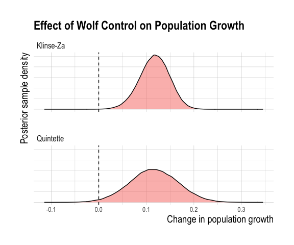

KZ and QT IPM results
================
Sara Williams, Hans Martin, and Clayton Lamb
12 December, 2020

# See folders KZ and QT for the IPM’s for each herd

## Load Data

``` r
library(ggmcmc)
library(jagsUI)
library(knitr)
library(gt)
library(ggallin)
library(hrbrthemes)
library(tidyverse)
library(rjags)
library(MCMCvis)
library(ggpubr)
library(readxl)
library(piggyback)
library(tidybayes)
library(here)

pb_download("kz_out_rnd_eff.Rdata", 
            repo = "ctlamb/KZ_QT_IPM",
            dest = here::here())
load(here::here("kz_out_rnd_eff.Rdata"))
kz <- out_rnd_eff
unlink(here::here("kz_out_rnd_eff.Rdata"))


yrs <-  seq(from = 1995, to = 2020, by = 1)
nyr <- length(yrs)
yr_idx <- seq(from = 1, to = nyr, by = 1)
kz_yr_df <- as.data.frame(cbind(yrs, yr_idx))


pb_download("qt_out_rnd_eff.Rdata", 
            repo = "ctlamb/KZ_QT_IPM",
            dest = here::here())
load(here::here("qt_out_rnd_eff.Rdata"))
qt <- out_rnd_eff
unlink(here::here("qt_out_rnd_eff.Rdata"))


yrs <-  seq(from = 2001, to = 2020, by = 1)
nyr <- length(yrs)
yr_idx <- seq(from = 1, to = nyr, by = 1)
qt_yr_df <- as.data.frame(cbind(yrs, yr_idx))


##counts
qt_count_dat <- read_xlsx(here::here("data", "QT", "Count_summary_QT.xlsx"))
kz_count_dat <- read_xlsx(here::here("data", "KZ", "Count_summary_KZ.xlsx"))

##raw vital rates
qt_vr <- read_csv(here::here("data", "QT", "vitalrate_validation_QT.csv"))
kz_vr <- read_csv(here::here("data", "KZ", "vitalrate_validation_KZ.csv"))

##set CrI
cri<-0.9
```

## ABUNDANCE

``` r
abund_MF <- kz %>%
          spread_draws(totNMF[i]) %>%
          median_qi(.width = cri)%>%
                     mutate(
                     param="Abundance (MF)",
                     herd="Klinse-Za")%>%
  cbind(kz_yr_df)%>%
  rbind(
    qt %>%
          spread_draws(totNMF[i]) %>%
          median_qi(.width = cri)%>%
                     mutate(
                     param="Abundance (MF)",
                     herd="Quintette")%>%
      cbind(qt_yr_df))%>%
  rename("lower" = ".lower",
         "upper" = ".upper",
         "est"="totNMF")%>%
  select(est,lower,upper,param,herd,yrs, yr_idx)

lambda_F <- kz %>%
          spread_draws(lambda[i]) %>%
          median_qi(.width = cri)%>%
                     mutate(
                     param="Population growth (F)",
                     herd="Klinse-Za")%>%
  cbind(kz_yr_df)%>%
  rbind(
    qt %>%
          spread_draws(lambda[i]) %>%
          median_qi(.width = cri)%>%
                     mutate(
                     param="Population growth (F)",
                     herd="Quintette")%>%
      cbind(qt_yr_df))%>%
  rename("lower" = ".lower",
         "upper" = ".upper",
         "est"="lambda")%>%
  select(est,lower,upper,param,herd,yrs, yr_idx)%>%
  mutate(est=case_when(yrs<=min(kz_yr_df$yrs) & herd=="Klinse-Za"~NA_real_, 
                       yrs<=min(qt_yr_df$yrs) & herd=="Quintette"~NA_real_, 
                                   TRUE~est))
  
  


ggplot(rbind(abund_MF,lambda_F),aes(x = yrs, y = est, ymin=lower, ymax=upper, fill=herd)) +
  #geom_cloud(steps=50, max_alpha = 1,se_mult=1.96)+
  geom_ribbon(alpha=0.4)+
  geom_line() +
  geom_point() +
  theme_ipsum()+
  theme(legend.position = "none")+
  ylab("")+
  xlab("Year")+
  facet_grid(param~herd, scales="free_y")+
  labs(x="Year",title="Population Trajectory")+
    expand_limits(y=0)+
  theme(axis.title.x = element_text(size=15),
        axis.title.y = element_text(size=15),
        strip.text.x = element_text(size=15),
        strip.text.y = element_text(size=15),
        legend.text = element_text(size=13),
        legend.title=element_text(size=15))+
    geom_vline(data=data.frame(herd=unique(abund_MF$herd),
                               param=rep(unique(rbind(abund_MF,lambda_F)$param),each=2),
                               year=rep(c(2012.5,2015.5)),times=2),
               aes(xintercept = year),linetype="dashed")+
      geom_vline(data=data.frame(herd=unique(abund_MF$herd),
                               param=rep(unique(rbind(abund_MF,lambda_F)$param),each=2),
                               year=rep(c(2013.5,NA)),times=2),
               aes(xintercept = year),linetype="solid")
```

<!-- -->

``` r
ggsave(here::here("plots", "abundance_MF.png"), width=8, height=8)
write_csv(abund_MF%>%mutate_if(is.numeric, round, 1), here::here("tables", "abundance_MF.csv"))

write_csv(kz %>%
          spread_draws(totN[i]) %>%
          median_qi(.width = cri)%>%
          mutate_if(is.numeric, round, 3)%>%
                     mutate(
                     param="Total F",
                     herd="Klinse-Za")%>%cbind(kz_yr_df), here::here("tables", "abundance_F.csv"))
```

## ABUNDANCE FIT

``` r
fit_df <- abund_MF%>%
  mutate(type="modelled")%>%
  #bind on observed data
  ##Estimates
  rbind(
    data.frame(est=kz_count_dat$Estimate_ADULTMF + kz_count_dat$Estimate_CALFMF,
                     lower=NA,
                     upper=NA,
                     param="Total M+F",
                     herd="Klinse-Za",
                     kz_yr_df,
                     type="Observed_Estimate")
    )%>%
  rbind(
     data.frame(est=qt_count_dat$Estimate_ADULTMF + qt_count_dat$Estimate_CALFMF,
                     lower=NA,
                     upper=NA,
                     param="Total M+F",
                     herd="Quintette",
                     qt_yr_df,
                     type="Observed_Estimate")
  )%>%
  ##Mincounts
    rbind(
          data.frame(est=kz_count_dat$`KZ total count_MAX`,
                     lower=NA,
                     upper=NA,
                     param="Total M+F",
                     herd="Klinse-Za",
                     kz_yr_df,
                     type="Observed_Mincount")
          )%>%
  rbind(
        data.frame(est=qt_count_dat$MinCount_ADULTMF + qt_count_dat$MinCount_CALFMF,
                     lower=NA,
                     upper=NA,
                     param="Total M+F",
                     herd="Quintette",
                     qt_yr_df,
                     type="Observed_Mincount")
  )


ggplot(data=fit_df%>%filter(type%in%"modelled"), aes(x = yrs, y = est, ymin=lower, ymax=upper, fill=type)) +
  #geom_cloud(steps=20, max_alpha = 1,se_mult=1.96)+
  geom_ribbon(alpha=0.4)+
  geom_line(aes(color=type)) +
  geom_point(aes(color=type)) +
  geom_jitter(data=fit_df%>%filter(!type%in%"modelled"),aes(color=type), size=1) +
  theme_ipsum()+
  ylab("Abundance")+
  xlab("Year")+
  facet_wrap(vars(herd), scales="free_y")+
  labs(x="Year",title="Population Trajectory")+
    expand_limits(y=0)+
  theme(axis.title.x = element_text(size=15),
        axis.title.y = element_text(size=15),
        axis.text = element_text(size=10),
        legend.text = element_text(size=13),
        legend.title=element_text(size=15))
```

<!-- -->

``` r
ggsave(here::here("plots", "abundancefit_MF.png"), width=9, height=5)
```

## VITAL RATES

``` r
#R

pop_df_r <- rbind(
kz %>%
  spread_draws(R[i,j]) %>%
  median_qi(.width = cri)%>%
  filter(j==2)%>%
  mutate(
    param="Recruitment",
    pop="KZ-Wolf + Pen")%>%
  left_join(kz_yr_df%>%rename(i=yr_idx))%>%
  ungroup()%>%
  select(est=R, lower=`.lower`, upper=`.upper`,param,pop,yrs),

kz %>%
  spread_draws(R[i,j]) %>%
  median_qi(.width = cri)%>%
  filter(j==1)%>%
  mutate(
    param="Recruitment",
    pop="KZ-Wolf")%>%
  left_join(kz_yr_df%>%rename(i=yr_idx))%>%
  ungroup()%>%
  select(est=R, lower=`.lower`, upper=`.upper`,param,pop,yrs),

qt %>%
  spread_draws(R[i]) %>%
  median_qi(.width = cri)%>%
  mutate(
    param="Recruitment",
    pop="QT-Wolf")%>%
  left_join(qt_yr_df%>%rename(i=yr_idx))%>%
  ungroup()%>%
  select(est=R, lower=`.lower`, upper=`.upper`,param,pop,yrs)
)

#S
pop_df_s <- rbind(
  kz %>%
  spread_draws(S[i,j]) %>%
  median_qi(.width = cri)%>%
  filter(j==2)%>%
  mutate(
    param="Survival",
    pop="KZ-Wolf + Pen")%>%
  left_join(kz_yr_df%>%rename(i=yr_idx))%>%
  ungroup()%>%
  select(est=S, lower=`.lower`, upper=`.upper`,param,pop,yrs),

kz %>%
  spread_draws(S[i,j]) %>%
  median_qi(.width = cri)%>%
  filter(j==1)%>%
  mutate(
    param="Survival",
    pop="KZ-Wolf")%>%
  left_join(kz_yr_df%>%rename(i=yr_idx))%>%
  ungroup()%>%
  select(est=S, lower=`.lower`, upper=`.upper`,param,pop,yrs),

qt %>%
  spread_draws(S[i]) %>%
  median_qi(.width = cri)%>%
  mutate(
    param="Survival",
    pop="QT-Wolf")%>%
  left_join(qt_yr_df%>%rename(i=yr_idx))%>%
  ungroup()%>%
  select(est=S, lower=`.lower`, upper=`.upper`,param,pop,yrs)
)


mod_vr <- rbind(pop_df_r, pop_df_s)%>%
         filter(yrs>1995)%>%
         mutate(est=case_when(param=="Recruitment" & yrs<=2015 & pop=="KZ-Wolf + Pen"~NA_real_, 
                                   param=="Survival" & yrs<=2014 & pop=="KZ-Wolf + Pen"~NA_real_, 
                                   TRUE~est))%>%
  mutate(type="Modelled")

ggplot(mod_vr,
       aes(x = yrs, y = est, fill=pop,ymin=lower, ymax=upper)) +
  geom_line(aes(color=pop)) +
  geom_ribbon(alpha=0.4)+
  theme_ipsum()+
  labs(x="Year", y="Rate", title="Annual vital rates")+
    geom_vline(data=data.frame(pop=unique(mod_vr$pop), yrs=c(2013.5,2012.5,2015.5), param="Recruitment")%>%
                 rbind(data.frame(pop=unique(mod_vr$pop), yrs=c(2013.5,2012.5,2015.5), param="Survival")),aes(xintercept = yrs),linetype="dashed")+
    facet_wrap(vars(param, pop), scales="free_y")
```

<!-- -->

``` r
ggsave(here::here("plots", "vitalrate_F.png"), width=9, height=5)
```

## COMPARE TO RAW VITAL RATE DATA

``` r
validate_vr <- kz_vr%>%mutate(pop=case_when(pop%in%"Free"~"KZ-Wolf",
                             pop%in%"Pen"~"KZ-Wolf + Pen"))%>%
  rbind(qt_vr%>%mutate(pop=case_when(pop%in%"Free"~"QT-Wolf")))%>%
  mutate(type="Observed")%>%
  rename(est=estimate)%>%
  select(colnames(mod_vr))%>%
  rbind(mod_vr)

  ggplot(validate_vr,aes(x = yrs, y = est, fill=type, ymin=lower, ymax=upper)) +
  geom_line(aes(color=type)) +
  geom_ribbon(alpha=0.4)+
  theme_ipsum()+
  labs(x="Year", y="Rate", title="Annual vital rates")+
    geom_vline(data=data.frame(pop=unique(mod_vr$pop), yrs=c(2013.5,2012.5,2015.5), param="Recruitment")%>%
                 rbind(data.frame(pop=unique(mod_vr$pop), yrs=c(2013.5,2012.5,2015.5), param="Survival")),aes(xintercept = yrs),linetype="dashed")+
    facet_wrap(vars(param, pop), scales="free_y")
```

<!-- -->

``` r
ggsave(here::here("plots", "vitalratefit_F.png"), width=9, height=5)

validate_vr%>%filter(param=="Recruitment", pop=="KZ-Wolf + Pen", yrs%in% c(2016:2020))
```

## WOLF EFFECT

``` r
##Refined Wolf Control== (2017-2020)

S <- ggs(qt$samples)%>%
  filter(Parameter%in%c("diff_geom_mean_lambda_post_to_pre","diff_geom_mean_lambda_post_to_pre_iwolf"))%>%
  mutate(Parameter=case_when(Parameter%in%"diff_geom_mean_lambda_post_to_pre"~"All Wolf Control",
                             Parameter%in%"diff_geom_mean_lambda_post_to_pre_iwolf"~"Refined Wolf Control"
                             ),
         Herd="Quintette")


S2 <- ggs(kz$samples)%>%
  filter(Parameter%in%c("wolf_eff","wolf_eff_iwolf"))%>%
    mutate(Parameter=case_when(Parameter%in%"wolf_eff"~"All Wolf Control",
                             Parameter%in%"wolf_eff_iwolf"~"Refined Wolf Control"
                             ),
         Herd="Klinse-Za")

wolf_effects <- rbind(S,S2)
rm(S)
rm(S2)

ggplot(wolf_effects%>%filter(Parameter%in%"All Wolf Control"), aes(x = value,fill=Parameter)) +
  geom_density(alpha=0.5) +
  theme_ipsum()+
  theme_ipsum()+
  labs(x="Change in population growth", y="Posterior sample density", title="Effect of Wolf Control on Population Growth")+
    geom_vline(xintercept = 0, linetype="dashed")+
  facet_wrap(vars(Herd), ncol=1)+
  theme(axis.title.x = element_text(size=15),
        axis.title.y = element_text(size=15),
        axis.text.y = element_blank(),
        axis.text.x = element_text(size=10),
        legend.text = element_text(size=13),
        legend.title=element_text(size=15),
        legend.position = "none")
```

<!-- -->

``` r
ggsave(here::here("plots", "wolf_effect.png"), width=6, height=5)
```

## KZ EFFECT

``` r
kz_effects <- ggs(kz$samples)%>%
  filter(Parameter%in%c("wolf_eff","pen_eff", "wolf_eff_iwolf","pen_eff_iwolf","pen_eff_ipen","wolf_eff_ipen"))

a <- kz_effects%>%
  pivot_wider(id_cols=c("Iteration", "Chain"), names_from = "Parameter", values_from = "value")%>%
  mutate(pen_eff=pen_eff+wolf_eff,
         pen_eff_iwolf=pen_eff_iwolf+wolf_eff_iwolf)%>%
  pivot_longer(-c("Iteration", "Chain"))%>%
  filter(name%in%c("pen_eff", "wolf_eff"))%>%
  mutate(name=case_when(name%in%"pen_eff"~"Pen + Wolf",
                        name%in%"wolf_eff"~"Wolf"))%>%
  rename(Treatment=name)%>%
ggplot(aes(x = value,fill=Treatment)) +
  geom_density(alpha=0.5) +
  theme_ipsum()+
  theme_ipsum()+
  labs(x="Change in population growth", y="Posterior sample density", title="Klinse-Za Treatment Effects")+
    geom_vline(xintercept = 0, linetype="dashed")+
  theme(axis.title.x = element_text(size=15),
        axis.title.y = element_text(size=15),
        axis.text.y = element_blank(),
        axis.text.x = element_text(size=10),
        legend.text = element_text(size=13),
        legend.title=element_text(size=15))


pop.sim <- kz %>%
  gather_draws(simTotC[i], simTotP[i], simTotBAU[i])%>%
  median_qi(.width = cri)%>%
  mutate(yrs=i+2013,
         Treatment=case_when(`.variable`%in% "simTotBAU"~ "Control",
                             `.variable`%in% "simTotC"~ "Wolf",
                             `.variable`%in% "simTotP"~ "Pen + Wolf"))%>%
    select(yrs, Treatment,"est"=".value","lower"=".lower","upper"=".upper")
 
b <- ggplot(pop.sim%>%mutate(Treatment=fct_relevel(Treatment,"Pen + Wolf","Wolf","Control")),
       aes(x = yrs, y = est, ymin=lower, ymax=upper, fill=Treatment, linetype=Treatment)) +
  geom_cloud(steps=20, max_alpha = 0.8,se_mult=1.96)+
  #geom_ribbon(alpha=0.2)+
  geom_line() +
  theme_ipsum()+
  labs(x="Year", y="Abundance", title="Simulated Female Abundance", subtitle="Same starting abundance, treatment applied to all females")+
  expand_limits(y=0)+
  theme(axis.title.x = element_text(size=15),
        axis.title.y = element_text(size=15),
        axis.text = element_text(size=10),
        legend.text = element_text(size=13),
        legend.title=element_text(size=15))


ggarrange(a,b,labels="AUTO")
```

<!-- -->

``` r
ggsave(here::here("plots", "KZ_effect_and_sim.png"), width=11, height=5)
```

## AGE STRUCTURE

``` r
pop_age <-as.data.frame(kz$mean$N[,,1])%>%
  mutate(pop="Free",
         year=kz_yr_df$yrs)%>%
  pivot_longer(-c("pop","year"))%>%
  mutate(name=str_sub(name,2,-1))%>%
rbind(
  as.data.frame(kz$mean$N[,,2])%>%
  mutate(pop="Pen",
         year=kz_yr_df$yrs)%>%
  pivot_longer(-c("pop","year"))%>%
  mutate(name=str_sub(name,2,-1))
)%>%
  mutate(herd="Klinse-Za")%>%
  rbind(as.data.frame(qt$mean$N[,,1])%>%
  mutate(pop="Free",
         year=qt_yr_df$yrs)%>%
  pivot_longer(-c("pop","year"))%>%
  mutate(name=str_sub(name,2,-1),
         herd="Quintette"))%>%
  mutate(name=case_when(name=="1"~"Juvenile",
                        name=="2"~"Sub-adult",
                        name=="3"~"Adult"),
         name=fct_relevel(name, "Adult","Sub-adult","Juvenile"))
  


pop_age%>%
  group_by(pop,year,herd)%>%
  mutate(sum=sum(value),
         value2=value/sum)%>%
  mutate(Ageclass=name)%>%
  ggplot(aes(x=year, y=value2, fill = Ageclass)) +
  geom_area()+
  ylab("Proportion in each ageclass")+
  xlab("Year")+
  facet_wrap(vars(herd,pop),nrow=3)+
    theme_ipsum()+
    theme(axis.title.x = element_text(size=15),
        axis.title.y = element_text(size=15),
        axis.text = element_text(size=10),
        legend.text = element_text(size=13),
        legend.title=element_blank())
```

<!-- -->

``` r
ggsave(here::here("plots", "AgeStructure.png"), width=6, height=11)

pop_age%>%
  filter(year>2013)%>%
  ggplot(aes(x=year, y=value, fill = name)) +
  geom_area()+
  ylab("Abundance")+
  xlab("Year")+
  facet_wrap(vars(herd,pop),nrow=3, scales="free_y")+
    theme_ipsum()+
    theme(axis.title.x = element_text(size=15),
        axis.title.y = element_text(size=15),
        axis.text = element_text(size=10),
        legend.text = element_text(size=13),
        legend.title=element_blank())
```

<!-- -->

## Summarize simulation population growth

``` r
summary.sim <- 
  kz %>%
  gather_draws(geom_mean_lambda_prepen,geom_mean_lambda_SimC2,geom_mean_lambda_SimPen)%>%
  median_qi(.width = cri)%>%
  mutate(pop="Klinse-Za",
         period=case_when(`.variable`%in% "geom_mean_lambda_prepen" ~"Control",
                          `.variable`%in% "geom_mean_lambda_SimC2" ~"Wolf",
                          `.variable`%in% "geom_mean_lambda_SimPen" ~"Wolf+Pen"))%>%
  mutate_if(is.numeric,function(x) round(x,2))%>%
  select(pop,period,"lambda"=".value","lower"=".lower","upper"=".upper")%>%
  arrange(pop,period)
  
colnames(summary.sim) <- c("Herd", "Period", "Lambda", "Lamba.Lower", "Lambda.Upper")


summary.sim <- summary.sim%>%
  mutate(`90% CrI`=paste(Lamba.Lower,Lambda.Upper, sep="-"))%>%
  select(Herd, Period, Lambda,`90% CrI`)

write_csv(summary.sim,here::here("tables", "sim_lambda.csv"))
kable(summary.sim)
```

| Herd      | Period   | Lambda | 90% CrI   |
| :-------- | :------- | -----: | :-------- |
| Klinse-Za | Control  |   0.89 | 0.88-0.9  |
| Klinse-Za | Wolf     |   0.97 | 0.92-1.02 |
| Klinse-Za | Wolf+Pen |   1.10 | 1.09-1.1  |

\#\#Wolf vs Pen effect

``` r
S <- ggs(kz$samples)%>%
  filter(Parameter%in%c("wolf_eff_proportion","pen_eff_proportion"))

S%>%
    mutate(Treatment=case_when(Parameter%in%"pen_eff_proportion"~"Pen",
                        Parameter%in%"wolf_eff_proportion"~"Wolf"))%>%
ggplot(aes(x = value,fill=Treatment)) +
  geom_density(alpha=0.5) +
  theme_ipsum()+
  labs(x="Proportion", y="Posterior sample density", title="Proportion Increase Attributable to Treatment")+
  xlim(0,1)+
  theme(axis.title.x = element_text(size=15),
        axis.title.y = element_text(size=15),
                axis.text.y = element_blank(),         axis.text.x = element_text(size=10),
        legend.text = element_text(size=13),
        legend.title=element_text(size=15))
```

<!-- -->

``` r
ggsave(here::here("plots", "KZ_effect_prop.png"), width=7, height=5)

kz$mean$wolf_eff_proportion
kz$mean$pen_eff_proportion
```

\#\#Summarize population growth

``` r
summary.l <- 
  kz %>%
  gather_draws(geom_mean_lambda_prepen,geom_mean_lambda_postwolf)%>%
  median_qi(.width = cri)%>%
  mutate(pop="Klinse-Za",
         period=case_when(`.variable`%in% "geom_mean_lambda_prepen" ~"pre-mgmt",
                          `.variable`%in% "geom_mean_lambda_postwolf" ~"post-mgmt"))%>%
rbind(
  qt %>%
  gather_draws(geom_mean_lambda_pre,geom_mean_lambda_post)%>%
  median_qi(.width = cri)%>%
  mutate(pop="Quintette",
         period=case_when(`.variable`%in% "geom_mean_lambda_pre" ~"pre-mgmt",
                          `.variable`%in% "geom_mean_lambda_post" ~"post-mgmt"))
    
  )%>%
  mutate_if(is.numeric,function(x) round(x,2))%>%
  select(pop,period,"lambda"=".value","lower"=".lower","upper"=".upper")%>%
  arrange(pop,period)
  
summary.l$Years <- c("2014-2020", "1996-2012", "2016-2020", "2002-2015")
colnames(summary.l) <- c("Herd", "Period", "Lambda", "Lamba.Lower", "Lambda.Upper", "Years")


summary.l <- summary.l%>%
  mutate(`90% CrI`=paste(Lamba.Lower,Lambda.Upper, sep="-"))%>%
  select(Herd, Period, Years, Lambda,`90% CrI`)

write_csv(summary.l,here::here("tables", "lambda.csv"))
kable(summary.l)
```

| Herd      | Period    | Years     | Lambda | 90% CrI   |
| :-------- | :-------- | :-------- | -----: | :-------- |
| Klinse-Za | post-mgmt | 2014-2020 |   1.07 | 1.05-1.09 |
| Klinse-Za | pre-mgmt  | 1996-2012 |   0.89 | 0.88-0.9  |
| Quintette | post-mgmt | 2016-2020 |   1.01 | 0.94-1.08 |
| Quintette | pre-mgmt  | 2002-2015 |   0.94 | 0.91-0.97 |

\#\#Summarize effect of treatments

``` r
summary.effect <- 
kz %>%
  gather_draws(diff_geom_mean_lambda_post_to_pre,wolf_eff,pen_eff)%>%
  median_qi(.width = cri)%>%
  mutate(pop="Klinse-Za",
         period=case_when(`.variable`%in% "diff_geom_mean_lambda_post_to_pre" ~"wolf + pen",
                          `.variable`%in% "pen_eff" ~"pen",
                          `.variable`%in% "wolf_eff" ~"wolf"))%>%
rbind(
  qt%>%
    gather_draws(diff_geom_mean_lambda_post_to_pre)%>%
    median_qi(.width = cri)%>%
    mutate(pop="Quintette",
         period=case_when(`.variable`%in% "diff_geom_mean_lambda_post_to_pre" ~"wolf"))
  )%>%
  mutate_if(is.numeric,function(x) round(x,3))%>%
  select(pop,period,"lambda difference"=".value","lower"=".lower","upper"=".upper")

write_csv(summary.effect,here::here("tables", "treatment_effect.csv"))
kable(summary.effect)
```

| pop       | period     | lambda difference |   lower | upper |
| :-------- | :--------- | ----------------: | ------: | ----: |
| Klinse-Za | wolf + pen |             0.179 |   0.157 | 0.202 |
| Klinse-Za | pen        |             0.100 |   0.048 | 0.151 |
| Klinse-Za | wolf       |             0.079 |   0.025 | 0.136 |
| Quintette | wolf       |             0.073 | \-0.020 | 0.164 |

\#\#Summarize vital rates

``` r
summary.s <- 
  kz %>%
  gather_draws(mean_surv_pre,mean_surv_pen,mean_surv_wolf,mean_surv_post_pooled)%>%
  median_qi(.width = cri)%>%
  mutate(pop="Klinse-Za",
         period=case_when(`.variable`%in% "mean_surv_pre" ~"pre-mgmt",
                          `.variable`%in% "mean_surv_pen" ~"post-mgmt (wolf+pen)",
                          `.variable`%in% "mean_surv_wolf" ~"post-mgmt (wolf)",
                          `.variable`%in% "mean_surv_post_pooled" ~"post-mgmt (pooled)"))%>%
rbind(
  qt %>%
  gather_draws(mean_surv_pre,mean_surv_post)%>%
  median_qi(.width = cri)%>%
  mutate(pop="Quintette",
         period=case_when(`.variable`%in% "mean_surv_pre" ~"pre-mgmt",
                          `.variable`%in% "mean_surv_post" ~"post-mgmt"))
    
  )%>%
  select(pop,period,"s"=".value","s.lower"=".lower","s.upper"=".upper")
  


summary.r <- 
    kz %>%
  gather_draws(mean_r_pre,mean_r_pen,mean_r_wolf,mean_r_post_pooled)%>%
  median_qi(.width = cri)%>%
  mutate(pop="Klinse-Za",
         period=case_when(`.variable`%in% "mean_r_pre" ~"pre-mgmt",
                          `.variable`%in% "mean_r_pen" ~"post-mgmt (wolf+pen)",
                          `.variable`%in% "mean_r_wolf" ~"post-mgmt (wolf)",
                          `.variable`%in% "mean_r_post_pooled" ~"post-mgmt (pooled)"))%>%
rbind(
  qt %>%
  gather_draws(mean_r_pre,mean_r_post)%>%
  median_qi(.width = cri)%>%
  mutate(pop="Quintette",
         period=case_when(`.variable`%in% "mean_r_pre" ~"pre-mgmt",
                          `.variable`%in% "mean_r_post" ~"post-mgmt"))
    
  )%>%
  select(pop,period,"r"=".value","r.lower"=".lower","r.upper"=".upper")


summary.r3 <- 
      kz %>%
  gather_draws(mean_r3_pre,mean_r3_pen,mean_r3_wolf,mean_r3_post_pooled)%>%
  median_qi(.width = cri)%>%
  mutate(pop="Klinse-Za",
         period=case_when(`.variable`%in% "mean_r3_pre" ~"pre-mgmt",
                          `.variable`%in% "mean_r3_pen" ~"post-mgmt (wolf+pen)",
                          `.variable`%in% "mean_r3_wolf" ~"post-mgmt (wolf)",
                          `.variable`%in% "mean_r3_post_pooled" ~"post-mgmt (pooled)"))%>%
rbind(
  qt %>%
  gather_draws(mean_r3_pre,mean_r3_post)%>%
  median_qi(.width = cri)%>%
  mutate(pop="Quintette",
         period=case_when(`.variable`%in% "mean_r3_pre" ~"pre-mgmt",
                          `.variable`%in% "mean_r3_post" ~"post-mgmt"))
    
  )%>%
  select(pop,period,"r.ad"=".value","r.ad.lower"=".lower","r.ad.upper"=".upper")


summary.vr <- summary.s%>%
  left_join(summary.r)%>%
  left_join(summary.r3)%>%
  arrange(pop,period)%>%
  mutate_if(is.numeric,function(x) round(x,2))
```

    ## Joining, by = c("pop", "period")
    ## Joining, by = c("pop", "period")

``` r
summary.vr$Years <- c("2014-2020","2013-2020","2014-2020","1995-2012" , "2016-2020","2002-2015")

summary.vr <- summary.vr%>%
  mutate(`s CrI`=paste(s.lower,s.upper, sep="-"),
         `r CrI`=paste(r.lower,r.upper, sep="-"),
         `r.ad CrI`=paste(r.ad.lower,r.ad.upper, sep="-"))%>%
  select(pop, period, Years, s,`s CrI`, r,`r CrI`,r.ad,`r.ad CrI`)


colnames(summary.vr) <- c("Group", "Period", "Years", "AF Survival","90% CrI", "Recruitment","r90% CrI", "Recruitment-Adult Only","r.ad.90% CrI")


write_csv(summary.vr,here::here("tables", "vital_rates.csv"))
kable(summary.vr)
```

| Group     | Period               | Years     | AF Survival | 90% CrI   | Recruitment | r90% CrI  | Recruitment-Adult Only | r.ad.90% CrI |
| :-------- | :------------------- | :-------- | ----------: | :-------- | ----------: | :-------- | ---------------------: | :----------- |
| Klinse-Za | post-mgmt (pooled)   | 2014-2020 |        0.87 | 0.85-0.9  |        0.19 | 0.19-0.2  |                   0.25 | 0.22-0.27    |
| Klinse-Za | post-mgmt (wolf)     | 2013-2020 |        0.85 | 0.8-0.9   |        0.12 | 0.1-0.13  |                   0.20 | 0.16-0.25    |
| Klinse-Za | post-mgmt (wolf+pen) | 2014-2020 |        0.91 | 0.91-0.91 |        0.28 | 0.28-0.28 |                   0.29 | 0.29-0.29    |
| Klinse-Za | pre-mgmt             | 1995-2012 |        0.79 | 0.77-0.82 |        0.12 | 0.1-0.13  |                   0.15 | 0.12-0.18    |
| Quintette | post-mgmt            | 2016-2020 |        0.86 | 0.81-0.9  |        0.18 | 0.15-0.21 |                   0.27 | 0.2-0.35     |
| Quintette | pre-mgmt             | 2002-2015 |        0.85 | 0.82-0.87 |        0.12 | 0.11-0.14 |                   0.18 | 0.14-0.51    |

## What proportion of non-calf females penned/yr

``` r
penned.prop <- kz %>%
  gather_draws(penprop[i])%>%
  median_qi(.width = cri)%>%
  cbind(kz_yr_df)%>%
  filter(yrs>=2014)

ggplot(penned.prop,aes(x = yrs, y = .value, ymin=.lower, ymax=.upper)) +
  geom_ribbon(alpha=0.4)+
  geom_line() +
  geom_point() +
  theme_ipsum()+
  theme(legend.position = "none")+
  ylab("Proportion")+
  xlab("Year")+
  labs(x="Year",title="Proportion of females (>1 yo) penned/yr")+
    expand_limits(y=0)+
  theme(axis.title.x = element_text(size=15),
        axis.title.y = element_text(size=15),
        strip.text.x = element_text(size=15),
        strip.text.y = element_text(size=15),
        legend.text = element_text(size=13),
        legend.title=element_text(size=15))
```

<!-- -->

\#Summarise over periods of improved treatment deliver

``` r
##KZ Effect INDIVIDUAL
kz_effects%>%
  pivot_wider(id_cols=c("Iteration", "Chain"), names_from = "Parameter", values_from = "value")%>%
  pivot_longer(-c("Iteration", "Chain"))%>%
  filter(!name%in%c("pen_eff_iwolf"," wolf_eff_ipen"))%>%
  mutate(name=case_when(name%in%"pen_eff"~"Pen",
                        name%in%"wolf_eff"~"Wolf",
                        name%in%"wolf_eff_iwolf"~"Refined Wolf",
                        name%in%"pen_eff_ipen"~"Refined Pen"
                        ))%>%
  rename(Treatment=name)%>%
ggplot(aes(x = value,fill=Treatment)) +
  geom_density(alpha=0.5) +
  theme_ipsum()+
  theme_ipsum()+
  labs(x="Change in population growth", y="Posterior sample density", title="Klinse-Za Individual Treatment Effects")+
    geom_vline(xintercept = 0, linetype="dashed")+
  theme(axis.title.x = element_text(size=15),
        axis.title.y = element_text(size=15),
        axis.text.y = element_blank(),
        axis.text.x = element_text(size=10),
        legend.text = element_text(size=13),
        legend.title=element_text(size=15))
```

<!-- -->

``` r
ggsave(here::here("plots", "refined_KZ_effect_individudal.png"), width=11, height=5)

#KZ Effect TOGETHER
kz_effects%>%
  pivot_wider(id_cols=c("Iteration", "Chain"), names_from = "Parameter", values_from = "value")%>%
  mutate(pen_eff=pen_eff+wolf_eff,
         pen_eff_iwolf=pen_eff_iwolf+wolf_eff_iwolf,
         pen_eff_ipen=pen_eff_ipen+wolf_eff_ipen)%>%
  pivot_longer(-c("Iteration", "Chain"))%>%
      filter(!name%in%c("wolf_eff_ipen"))%>%
  mutate(name=case_when(name%in%"pen_eff"~"Pen + Wolf",
                        name%in%"wolf_eff"~"Wolf",
                        name%in%"wolf_eff_iwolf"~"Refined Wolf",
                        name%in%"pen_eff_iwolf"~"Refined Pen + Refined Wolf",
                        name%in%"pen_eff_ipen"~"Refined Pen + Wolf"
                        ))%>%
    filter(!name%in%c("pen_eff_iwolf"," wolf_eff_ipen"))%>%
  rename(Treatment=name)%>%
ggplot(aes(x = value,fill=Treatment)) +
  geom_density(alpha=0.5) +
  theme_ipsum()+
  theme_ipsum()+
  labs(x="Change in population growth", y="Posterior sample density", title="Klinse-Za Individual Treatment Effects")+
    geom_vline(xintercept = 0, linetype="dashed")+
  theme(axis.title.x = element_text(size=15),
        axis.title.y = element_text(size=15),
        axis.text.y = element_blank(),
        axis.text.x = element_text(size=10),
        legend.text = element_text(size=13),
        legend.title=element_text(size=15))
```

<!-- -->

``` r
ggsave(here::here("plots", "refined_KZ_effects.png"), width=11, height=5)
```

\#\#Refined Wolf reduction

``` r
  ggplot(wolf_effects%>%filter(Parameter%in%"Refined Wolf Control"), aes(x = value,fill=Parameter)) +
  geom_density(alpha=0.5) +
  theme_ipsum()+
  theme_ipsum()+
  labs(x="Change in population growth", y="Posterior sample density", title="Effect of Refined Wolf Control on Population Growth")+
    geom_vline(xintercept = 0, linetype="dashed")+
  facet_wrap(vars(Herd), ncol=1)+
  theme(axis.title.x = element_text(size=15),
        axis.title.y = element_text(size=15),
                axis.text.y = element_blank(),         axis.text.x = element_text(size=10),
        legend.text = element_text(size=13),
        legend.title=element_text(size=15),
        legend.position = "none")
```

<!-- -->

``` r
ggsave(here::here("plots", "refined_wolf_effect.png"), width=7, height=5)
```

\#\#Summarize effect of refined treatments

``` r
summary.effect.refined <- 
kz %>%
  gather_draws(diff_geom_mean_lambda_post_to_pre_iwolf,diff_geom_mean_lambda_post_to_pre_ipen,wolf_eff_iwolf,pen_eff_ipen)%>%
  median_qi(.width = cri)%>%
  mutate(pop="Klinse-Za",
         period=case_when(`.variable`%in% "diff_geom_mean_lambda_post_to_pre_iwolf" ~"refined wolf + refined pen",
                          `.variable`%in% "diff_geom_mean_lambda_post_to_pre_ipen" ~"wolf + refined pen",
                          `.variable`%in% "wolf_eff_iwolf" ~"refined wolf",
                          `.variable`%in% "pen_eff_ipen" ~"refined pen"))%>%
rbind(
  qt%>%
    gather_draws(diff_geom_mean_lambda_post_to_pre_iwolf)%>%
    median_qi(.width = cri)%>%
    mutate(pop="Quintette",
         period=case_when(`.variable`%in% "diff_geom_mean_lambda_post_to_pre_iwolf" ~"Refined wolf"))
  )%>%
  mutate_if(is.numeric,function(x) round(x,3))%>%
  select(pop,period,"lambda difference"=".value","lower"=".lower","upper"=".upper")

write_csv(summary.effect.refined,here::here("tables", "refined_treatment_effect.csv"))
kable(summary.effect.refined)
```

| pop       | period                     | lambda difference |   lower | upper |
| :-------- | :------------------------- | ----------------: | ------: | ----: |
| Klinse-Za | wolf + refined pen         |             0.172 |   0.147 | 0.198 |
| Klinse-Za | refined wolf + refined pen |             0.155 |   0.125 | 0.185 |
| Klinse-Za | refined pen                |             0.100 |   0.044 | 0.159 |
| Klinse-Za | refined wolf               |             0.046 | \-0.032 | 0.116 |
| Quintette | Refined wolf               |             0.138 |   0.062 | 0.214 |

\#\#Summarize refined period population growth

``` r
summary.l.refined <- 
  kz %>%
  gather_draws(geom_mean_lambda_prepen,geom_mean_lambda_postpen_iWolf,geom_mean_lambda_postpen_iPen, geom_mean_lambda_SimC_iWolf,geom_mean_lambda_SimPen_iPen)%>%
  median_qi(.width = cri)%>%
  mutate(pop="Klinse-Za",
         period=case_when(`.variable`%in% "geom_mean_lambda_prepen" ~"pre-mgmt",
                          `.variable`%in% "geom_mean_lambda_postpen_iWolf" ~"post-mgmt (refined wolf + refined pen)",
                          `.variable`%in% "geom_mean_lambda_postpen_iPen" ~"post-mgmt (wolf + refined pen)",
                          `.variable`%in% "geom_mean_lambda_SimC_iWolf" ~"post-mgmt (refined wolf)",
                          `.variable`%in% "geom_mean_lambda_SimPen_iPen" ~"post-mgmt (refined pen)")
         )%>%
rbind(
  qt %>%
  gather_draws(geom_mean_lambda_pre,geom_mean_lambda_post_iwolf)%>%
  median_qi(.width = cri)%>%
  mutate(pop="Quintette",
         period=case_when(`.variable`%in% "geom_mean_lambda_pre" ~"pre-mgmt",
                          `.variable`%in% "geom_mean_lambda_post_iwolf" ~"post-mgmt (refined wolf)"))
    
  )%>%
  mutate_if(is.numeric,function(x) round(x,2))%>%
  select(pop,period,"lambda"=".value","lower"=".lower","upper"=".upper")%>%
  arrange(pop,period)
  
summary.l.refined$Years <- c("2016-2020", "2017-2020","2017-2020", "2016-2020","1996-2013", "2017-2020", "2002-2015")
colnames(summary.l.refined) <- c("Herd", "Period", "Lambda", "Lamba.Lower", "Lambda.Upper", "Years")


summary.l.refined <- summary.l.refined%>%
  mutate(`90% CrI`=paste(Lamba.Lower,Lambda.Upper, sep="-"))%>%
  select(Herd, Period, Years, Lambda,`90% CrI`)

write_csv(summary.l.refined,here::here("tables", "refined_lambda.csv"))
kable(summary.l.refined)
```

| Herd      | Period                                 | Years     | Lambda | 90% CrI   |
| :-------- | :------------------------------------- | :-------- | -----: | :-------- |
| Klinse-Za | post-mgmt (refined pen)                | 2016-2020 |   1.13 | 1.13-1.13 |
| Klinse-Za | post-mgmt (refined wolf + refined pen) | 2017-2020 |   1.05 | 1.02-1.07 |
| Klinse-Za | post-mgmt (refined wolf)               | 2017-2020 |   0.94 | 0.86-1.01 |
| Klinse-Za | post-mgmt (wolf + refined pen)         | 2016-2020 |   1.06 | 1.04-1.09 |
| Klinse-Za | pre-mgmt                               | 1996-2013 |   0.89 | 0.88-0.9  |
| Quintette | post-mgmt (refined wolf)               | 2017-2020 |   1.08 | 1.01-1.14 |
| Quintette | pre-mgmt                               | 2002-2015 |   0.94 | 0.91-0.97 |
